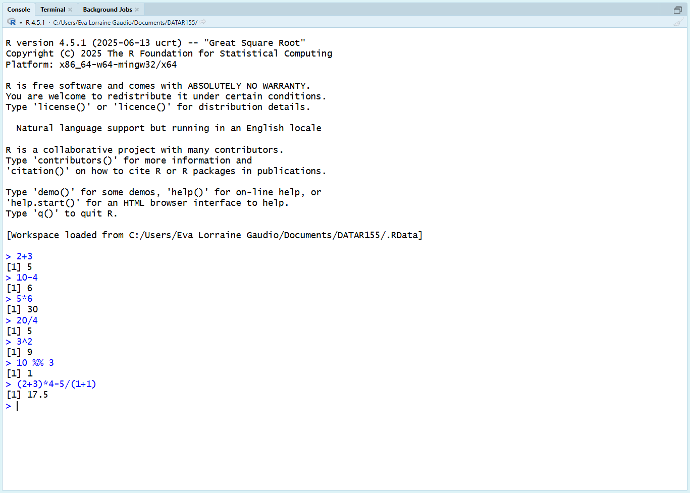
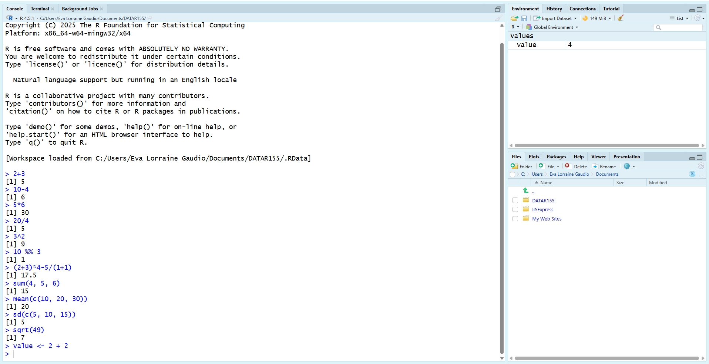
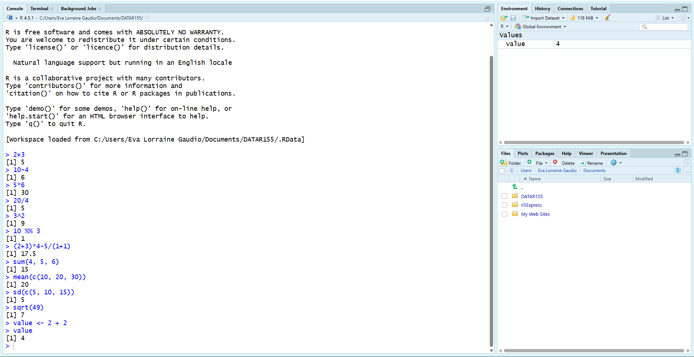
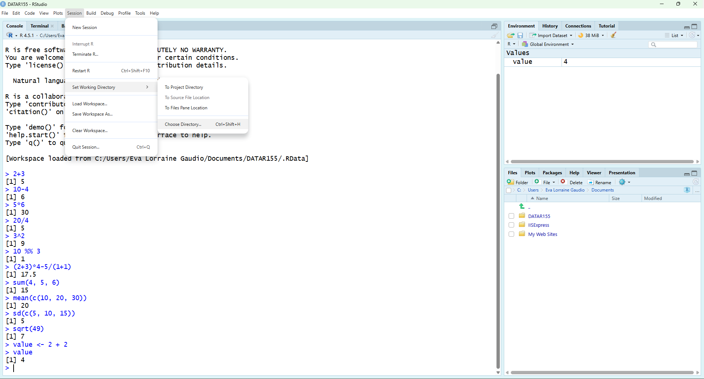
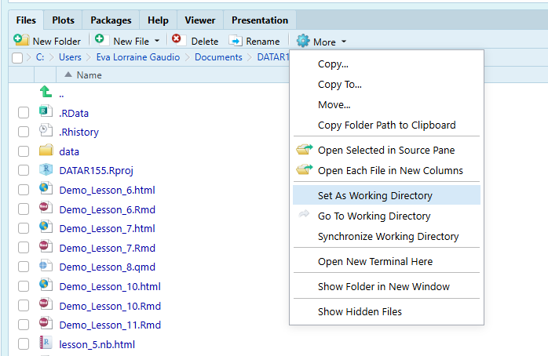
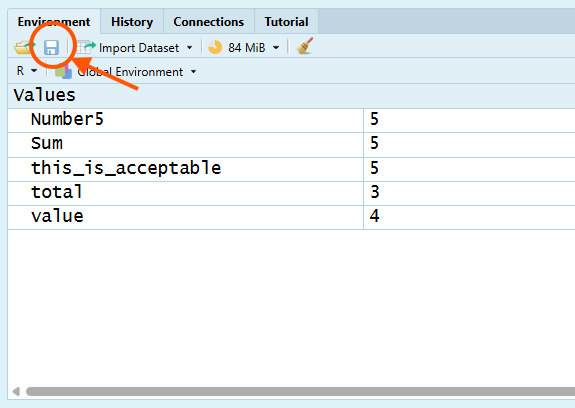
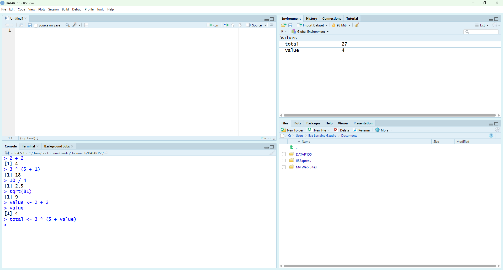

```{r setup, include=FALSE}
knitr::opts_chunk$set(echo = TRUE)
```

# Overview

TODO: WRITE AN OVERVIEW AND WHY LEARNING THE CHAPTER CONTENT IS IMPORTANT.

In the Part One A you will learn how to:

- 🖥 Open RStudio and identify its main panes.

- ⚡ Do simple arithmetic in R.

- 🛠 Create and inspect objects with the assignment operator (`<-`).

- 🔍 Follow R's object-naming rules.

In the Part One B you will learn how to:

- 📦 Save your workspace (environment).

- 🧹 Remove objects you no longer need.

- 📤 Upload your RData to Canvas

In the Part Two you will learn how to:


# Part 1 A

**RStudio Desktop** should already be installed on your computer. You can identify RStudio by its distinctive round blue icon as shown in Figure 1. If you do not have RStudio installed, please refer to the installation instructions provided in the course materials.


Grey code boxes like this one below contains instructions for you to follow. Complete these tasks to aid your learning. 

```{r echo=FALSE}
# Open RStudio Desktop.  
```

You should see a window with four main panes (see Figure 2).

1. **Console** – where R runs commands and shows results  
2. **Environment** – where you can see the objects (data, vectors, functions) in your current session  
3. **Script Editor (Source)** – where you write and save your R scripts and notebooks 
4. **Files and Help** – where you browse files and access plots, packages, and help pages


💡 **Tip:** If your layout looks different, that’s okay—RStudio lets you move panes. Look at the **tab labels** in each pane (for example, *Console*, *Environment*, *Files*, *Help*) to identify them. You can always reset the layout later using **Tools → Global Options → Pane Layout**.

## Console

The Console is where R runs commands. R performs standard operations like addition (`+`), subtraction (`-`), multiplication (`*`), division (`/`), exponentiation (`^` or `**`), and modulo (`%%`) with the correct order of operations (`PEMDAS`). 

🎯 Type mathematical calculations in the Console.

```{r eval=FALSE}
# ⚡ Type this in the Console and press Enter
# Addition
2 + 3  # Adds 2 and 3

# Subtraction
10 - 4 # Subtracts 4 from 10

# Multiplication
5 * 6  # Multiplies 5 and 6

# Division
20 / 4 # Divides 20 by 4

# Exponents
3^2    # Calculates 3 to the power of 2

# Modulo
10 %% 3 # Remainder of 10 divided by 3

# Combined operations
(2 + 3) * 4 - 5 / (1 + 1) # Mixes several operations
```



🗣 R prints results immediately. 

💡 **Tip:** If you make a typo, use the **Up/Down arrow keys** to go back through previous commands, edit the line, and press Enter to re-run it.


## Functions

Many mathematical operations in R are performed using **functions**. A function is a reusable block of code that takes inputs, processes them, and returns an output. Functions can be built-in or user-defined. In this course, we will only use built-in functions. Many functions have **arguments** (inputs) that you provide inside the parentheses. 

Built-in mathematical functions include `sum()`, `mean()`, `sd()`, and `sqrt()`. These functions require arguments to specify the data they operate on.

🎯 Use built-in mathematical functions

```{r eval=FALSE}
# ⚡ Type this in the Console and press Enter
# Sum of numbers
sum(4, 5, 6)  # Adds 4, 5, and 6

# Mean (average) of numbers
mean(c(10, 20, 30)) # Calculates the average of 10, 20, and 30

# Standard deviation of numbers
sd(c(5, 10, 15))    # Calculates the standard deviation of square root of a number

# Square root of a number
sqrt(49)            # Calculates the square root of 49
```

🗣 R prints the results of each function call in the console. 

We'll use functions throughout this course. Before we dive into more details about functions, we need to learn a little bit about the Environment pane. 

## Global Environment

During a session, You can create or load **objects** into the global environment. These are named containers that store data values (such as numbers, vectors, data tables, or models), which can then be accessed and manipulated later. Objects are also sometimes called variables, identifiers, or data structures. 

The **Environment** pane lists all of the objects that currently exist in your R session and gives a quick preview of their contents.

### Naming and Storing Results

An **object name** is the label you use to retrieve something you stored. The **assignment operator** `<-` (or `->`) is used to **store** a result in an object (a named container). This is how you give a result a name so you can reuse it later.

🎯 Use `<-` to store the result of `2 + 2` in an object named `value`.

```{r}
# ⚡ Type this in the Console and press Enter
value <- 2 + 2
```

🗣 The object name is `value` and the the object is the number *4*. 

🧐 NOTICE that nothing printed in the Console when you ran the assignment; the result was saved instead of displayed. The Environment pane helps you track which names currently exist.



💡 **Tip:** The `=` symbol has a dual role in R: it acts as an assignment operator (interchangeable with `<-` in most contexts) and as a special syntactic token for binding named arguments within a function call. For practical programming in RStudio, you should use `<-` as the conventional assignment operator to avoid confusion with function arguments. 

🎯 Print the stored value by typing the name of the object in the console and pressing Enter.

```{r eval=FALSE}
# ✅  Check the stored value
value
```



💡 **Tip:** You can also use the `print()` function to display the value of an object. Type the object name inside of the parenthesis to use this function.

```{r eval=FALSE}
# ✅ Check the stored value using the print() function
print(value)
```

### Object Naming Rules

R won’t accept just any text as an object name. R will not accept object names with a space between words. Object names are case-sensitive and may contain **letters**, **digits**, **periods** (`.`), and **underscores** (`_`). 

To separate words, this course will usually use **snake_case** (e.g., `my_object_name`). You may also see dotted notation (e.g., `my.object.name`) or **CamelCase** (e.g., `myObjectName`).

Names *cannot* start with (1) a digit or (2) a period followed by a digit. Something like `.5` is tokenized as a number, not a name. Additionally they cannot be the same as (3) R’s reserved words (like `if`, `else`, `repeat`, `function`, `TRUE`, `FALSE`, `NULL`, etc.). 

You can use backticks (`` ` ``) to create names that include spaces or special characters, although this is not recommended for everyday use. The backtick is located above the Tab key on most keyboards.

🛠 Break Things! Try valid and invalid names.

```{r eval=FALSE}
# ⚡ Type this in the Console and press Enter
# Valid names
total              <- 5
Sum                <- 5
.fine.with.dot     <- 5
this_is_acceptable <- 5
Number5            <- 5

# Invalid names (will produce errors without backticks)
tot@l <- 5  # @ is not allowed
5um   <- 5  # cannot start with a digit
_five <- 5  # cannot start with underscore
TRUE  <- 5  # built-in constant; do not use as a name
.5number  <- 5  # starts with . followed by digit (tokenizes like a number)
number five <- 5  # space not allowed without backticks
```
🗣 R will return error messages for the invalid names unless you use backticks. 

## R Syntax Basics

The smallest meaningful units R reads when it parses your code is called a **token**. R breaks each line into tokens, then checks whether that sequence forms valid syntax.

White space between **tokens** is generally flexible and ignored by the interpreter for most operations, which offers a high degree of formatting freedom for readability. The whitespace inside a multi-character token can change meaning, because it splits the token.

🛠 Break Things! Test out this by adding extra spaces or removing spaces around the assignment operator `<-` when creating a new object named `total` that stores the value `5 - 2`.

```{r eval=FALSE}
# ⚡ Type this in the Console and press Enter
total<-5-2           # tokens: total, <-, 5, -, 2 (stores 5 minus 2)

total   <-   5  -  2 # tokens: total, <-, 5, -, 2 (stores 5 minus 2)
```

🗣 R tokenizes `total` (name/identifier), `<-` (assignment operator), `5` and `2` (number), and `-` (mathematical operator).

```{r eval=FALSE}
# ⚡ Type this in the Console and press Enter
total < -5 -2        # tokens: total, <, -5, -, 2 (tests if total is less-than negative 7)
```
🗣 R tokenizes th`total` (name/identifier), `<` (comparison operator), `-5` (negative number), and `-` (mathematical operator), and `2` (number). This line does not store a value; instead, it tests whether `total` is less than negative 7, returning `TRUE` or `FALSE`.

## Summary

The Console is where R runs commands and shows results. You can perform arithmetic operations directly in the Console or use built-in functions like `sum()` and `mean()` to perform calculations. The Environment pane displays the objects you create during your session. You can store results in objects using the assignment operator `<-`, following R's object-naming rules. R reads your code as tokens (the smallest meaningful units, like names, numbers, and operators). Spaces usually don’t matter between tokens (`x<-1` and `x <- 1` behave the same), but a space can change meaning if it splits or changes tokens. For example, `total<-5` assigns `-5` to `total` when written as `total < -5` because R now sees the `<` operator followed by the number `-5`. Also, a space can’t appear inside an object name because it would split the name into two tokens (number five), which is invalid unless you use backticks like `` `number five` ``.

# Part 1 B

The **working directory** is where files actually go when you save them from RStudio. By default, RStudio sets your working directory to a folder in your user profile (like Documents). A common challenge for early RStudio users is having trouble finding their saved files because they were not aware of the working directory. Navigating the Files pane does not change your working directory. You must explicitly set it. 

🎯 Check where R will save files right now.

```{r eval=FALSE}
# ⚡ Type this in the Console and press Enter
getwd()
```
🗣 R prints the current working directory path in the Console. 

🧐 NOTICE: There is no *argument* inside the parentheses of `getwd()`. This is because `getwd()` does not require any inputs to return the current working directory.

## Folder Organization

Keep your coursework organized by creating a dedicated folder for this course on your computer. You will then set that folder as your working directory in RStudio.

```{r eval=FALSE}
# Outside of RStudio:
# 1. Open your file explorer (e.g., File Explorer on Windows, Finder on macOS).
# 2. Navigate to a location where you want to create the folder (e.g., Documents).
# 3. Create a new folder named "Intro_to_R" or "DATA_R155". 
```

💡 **Tip:**: I recommend local, non-synced storage for R work when possible (sync tools can cause file-locking / sync churn / path issues). For example, windows users should avoid creating their course folder inside a "OneDrive" folder. And macOS users should avoid creating their course folder inside of "iCloud".

While it is common for RStudio manuscripts to instruct users to set the working directory using the function `setwd()`, RStudio provides a convenient UI method. Using the UI method helps avoid typos in the file path. There are two reliable UI routes to set the working directory:

1. **Session Menu**: At the top of RStudio, click `Session` → `Set Working Directory` → `Choose Directory…`, then navigate to and select your course folder.



2. **Files Pane**: In the Files pane, navigate to your course folder. Then click the `More` button (three vertical dots) and select `Set As Working Directory`.



🎯 Set the working directory using the UI

```{r eval=FALSE}
# ⚡ Use either the Session menu or Files pane method described above.
```

🗣 RStudio sets your working directory to the selected folder. You can confirm this by running `getwd()` again in the Console.


```{r eval=FALSE}
# ✅ Check the working directory again
getwd()
```
🗣 R prints the updated working directory path in the Console.

### Saving Objects

Saving your workspace is a convenient way to preserve all of the objects you have created during your R session. It also allows you to share your objects with your collaborators. R users can easily load them into R.

Most assignments in this course will require that you submit your R workspace (environment) as an R Data file (`.RData`). This file contains all of the objects you have created during your session.

There are two primary functions for saving your workspace:

1. Click the **Save Workspace** icon (floppy disk) in the Environment pane. This opens a dialog to choose a file name and location to save your workspace as an `.RData` file.



2. `save.image()`: Saves the entire workspace (all objects) to a specified file.


🎯 Save your entire workspace to a file named `workspace.RData` in your working directory.

```{r}

# Save the entire workspace
save.image(file = "workspace.RData")
```


### Removing Objects


You can view or remove items:

```{r}
# Look at what's in the environment
ls()

# Remove one object 
rm(total)
```

# Part 2 A


## Script Editor (Source)

To document and track your work, use the Script Editor (Source pane). Here, you can write and save R code in a script file.


To create a new script, click the "New File" icon (or use Ctrl+Shift+N). Manually type in the following script.

```{r}
# install_r_script.R
# Lines that start with # are comments for humans, not code for R to run.

# 1) Do some math
a <- 6 * 7
b <- a + 5
result <- b / 3

# 2) Check the results
a
b
result

# 3) A tiny vector example
scores <- c(88, 92, 76, 95)
mean(scores)   # average
length(scores) # how many values?
```

Running code from a script (order matters!)

1. Place your cursor on a line and click Run (or press Ctrl+Enter on Windows/Linux or Cmd+Return on macOS) to send that line to the Console where it executes.

2. Select multiple lines to run them together.

3. Run in order from top to bottom so that objects (like a, b, scores) exist before you use them.

Pro move: You can quickly comment/uncomment selected lines with Ctrl+Shift+C (Windows/Linux) or Cmd+Shift+C (macOS).

## Files

Now save your script it with Ctrl+S. Navigate your folder system to find a good place to save it, like your Documents folder for this course. Name it `firstlastname_install_r_script.R`.

The Files pane shows files in your current working directory. You can navigate folders, open files, and manage your workspace here. 

```{r eval = FALSE}
getwd()        # current working directory (matches what Files is showing)
```

```{r}
# setwd("C:/Users/YourName/Documents/") # change to your desired folder
```

Note: Students using OneDrive may find issues navigating the folder system. 


### Using Objects in Calculations

Objects behave like reusable building blocks: once you have stored a value in an object, you can use that object inside new calculations.

🎯 Create a new object named `total` that uses the existing `value` object in a calculation.

```{r}
# ⚡  Type this in the Console and press Enter
total <- 3 * (5 + value)
```



🗣 The new object named `total` appears in the Environment pane containing the single value "27". You can now use total in later commands the same way—by typing its name in the Console or inside other expressions.


## RStudio Projects

RStudio Projects help you organize your work. They create a self-contained environment with its own working directory, making it easier to manage files and settings. It's best practice to use a separate project per course or project. A project keeps all files—scripts, data, outputs—in one self-contained folder, making things organized, reproducible, and shareable. Using an RStudio project eliminates the need for setwd(). Instead, file paths can be relative to the project folder, which makes scripts more portable.

1. Go to File → New Project…

2. In the dialog that appears, choose “New Directory”.

3. Select “Empty Project” (simplest for begginers) 

4. Give your project a meaningful name like "Intro_to_R" and choose where it’ll be on your computer.

5. Click Create Project.

- This makes a new folder at the chosen location.

- Inside this folder, RStudio creates a .Rproj file 

6. RStudio automatically sets your working directory to this new project folder. Everything you read or write in R will happen here. Confirm with:

```{r, eval=FALSE}
getwd()  # should show your new project folder
```

Close the project by going to File → Close Project.

Practice opening the project again by 

1. Closing RStudio. Now find your project folder in your file system and double-click the .Rproj file and this will open RStudio.

2. Going to File → Open Project and selecting the .Rproj file you just created.


