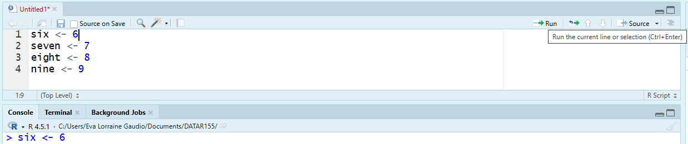
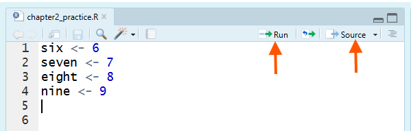

```{r setup, include=FALSE}
knitr::opts_chunk$set(echo = TRUE)
```

# Overview

In Chapter 2, you will move from one-off Console commands to scripts, which are the durable record of your work: what you ran, in what order, and why. You will practice writing code in the Source pane and running it into the Console (line-by-line or in blocks) using RStudio’s Run tools and shortcuts. You will also learn how to use comments as memos to document errors and your troubleshooting process (tenacity). You will practice this as you build vectors of several basic types, checks with `class()` and `length()`, and a simple data frame. 

In Chapter Two you will learn how to:

- 📝 Write and save R scripts.

- 📍 Run code from a script or the console.

- 💪 Practice resiliency through documenting tenacity on memos.

- 🛠 Build numeric, integer, character, and logical vectors.

- 🔍 Check the class and length of any vector object.

- 📊 Create a data frame from vectors.


# Script Editor (Source)

Documenting your work allows you and others to understand how you came to your results. One way to document your work is to write and save R scripts. An **R script** is a plain text file that contains a series of R commands. You can create, edit, and run R scripts in the Script Editor (also called the Source pane) in RStudio. 

Method A. **File Menu**

1. Go to the File menu at the top left of RStudio.

2. Select New File and then R Script. 


Method B. **Keyboard Shortcut**

1. Use the keyboard shortcut Ctrl + Shift + N (or Cmd + Shift + N on a Mac).

🎯 Open a new R Script.

```{r, eval=FALSE}
# Create a new script 
```

🗣 An empty script opens in the Script Editor (also called the Source pane). 

```{r, eval=FALSE}
# ⚡ Type this in your R Script
six <- 6
seven <- 7
eight <- 8
nine <- 9
```

## Run Code

🎯 Place your cursor on each line and click Run (or press Ctrl+Enter on Windows/Linux or Cmd+Return on macOS) to send that line to the Console where it executes.



```{r, eval=FALSE}
# Run one line
```

🎯 Select multiple lines to run them together.


```{r, eval=FALSE}
# Run multiple lines at the same time
```

🎯 Click Source to run the entire script at once.



```{r, eval=FALSE}
# Source the entire script
```

## Save Your Script

Saving your R script preserves the instructions (your code and comments), not the objects in your Environment. This matters because when you restart R or switch computers your Environment can disappear. Your script is a document of your work. A saved script lets anyone re-run your code and reproduce your results.

Most assignments in this course will require that you submit file that contains code and memos. Early modules require you submit an R script file (`.R`). The .R extension helps RStudio (and your computer) recognize the file as an R script. 

There are two primary ways to save your script. You can use either method.

Method A. **Save icon**

1. Click the Save icon (floppy disk) in the toolbar of the Script Editor pane.


Method B. **File Menu**

1.  Go to the File menu at the top left of RStudio.

2. Select Save As....

```{r, eval=FALSE}
# Save your script in your course folder (e.g., Intro_to_R)
# File name: chapter2_practice
# Save a type: R
```

🧐 **Notice:** that the file extension `.R` is automatically added.

```{r eval=FALSE}
# ✅ Verify that `chapter2_practice.R` is in the right folder.
```

💡 **Tip:** “Working directory” controls where R looks for files when you use relative paths, but you can still accidentally save a script somewhere else if you choose the wrong folder in the Save dialog. For this course, always save scripts into your course folder so your files stay together and you can find them when it’s time to upload.

💡 **Tip:** When your script is unsaved, RStudio typically shows an asterisk (*) in the script tab and the file name is red, which means you have changes that are not saved yet. 
___ 
📖 **Review**

Recall that objects are names that store elements in R. You can use objects in calculations just like you would use numbers.

```{r, eval=FALSE}
# ⚡ Type this in your R Script
# The Incident: Why is 6 afraid?
seven_eight <- seven + eight

# The Result:
the_aftermath <- seven_eight - nine
```

```{r eval=FALSE}
# ✅ What number should be scared?
print(the_aftermath)
```
___

🎯 Run in order from top to bottom so that objects exist before you use them.

```{r, eval=FALSE}
# Select and run in order
```

🛠 **Break Things!** Order matters when editing and running code from a script. 

Pretend that you decided to change the name of `seven + eight` to `seven.eight`. 

🎯 Edit your script. 

```{r, eval=FALSE}
# Edit the object name
seven.eight <- seven + eight
the_aftermath <- seven.eight - nine
```

Go back to your script and run ONLY `the_aftermath` line (without running the lines above it).

```{r, eval=FALSE}
# Run only this line
the_aftermath <- seven.eight - nine
```

🗣 Error: object 'seven.eight' not found. This is an error because `seven.eight` has not been created yet in this session.

🚧  **Errors** prevent code from running. 

🤔 No Error? This example may not error if you already ran `seven.eight <- seven + eight` before `the_aftermath <- seven.eight - nine`. Another way you can produce the error is by clearing the Environment before testing. 🧹 Sweep your environment and run code out of order.

💡 **Tip:** All scripts submissions must be able to run from top to bottom without errors. Regularly test your script by clicking Source to ensure that all lines run without errors.

___

Throughout this course, you will see 🛠 **Break Things!**. This means we will create an error on purpose. In R, an error message is not a judgment. It is the computer telling you exactly what it cannot do *yet*. Learning to read errors calmly and then adjusting your next step is a core part of learning to code. 

# Tenacity

To successfully learn R programming, you will need to persist through difficulties, revise code, and know when to seek help after genuine effort. Tenacity is the learning skill that shows up when you persist through obstacles (confusion, errors, frustration), revise your approach, and know when to seek help after genuine effort rather than quitting too early or grinding aimlessly (King, 2021; Baehr, 2022). Tenacity is not “never give up.” It’s productive persistence.

## Why R is Challenging

R is not hard because it’s mysterious. It’s hard because it’s precise. Small mistakes (a missing parenthesis, a comma in the wrong place, a misspelled object name) produce errors, and those errors are not personal—they’re information.

You may have already encountered friction in exactly the places beginners expect to be “simple”:

- Installing or updating R/RStudio

- Saving and submitting scripts and file to Canvas 

- Creating objects and then getting object not found errors

If you treat every error as evidence you “can’t code,” you will stall. Tenacity is what keeps you moving long enough for the patterns to become familiar (King, 2021).

## Two Ways of Getting Stuck

1) Giving up too early (irresolution).
This looks like skipping checks, continuing “halfway,” or abandoning the task the moment you feel lost (King, 2021). In R, that often becomes: running code you don’t understand, hoping it works, and stacking confusion.

2) Pushing too long (intransigence).
This looks like repeating the same approach for too long even though it isn’t working, refusing to change strategy, and refusing help (King, 2021). In R, that often becomes: re-running the same broken line 30 times.

Tenacity lives in the middle: persist, then recalibrate.

## How to Document Your Tenacity

When you get stuck, document your tenacity on a memo. 

### R Script Memos

To add comments in an R script, simply use the "#" symbol at the beginning of a line to indicate that the following text is a comment and should be ignored by the R interpreter.

You can add a line break to a long comment by using the # symbol on each new line. This is necessary because R interprets everything on a single line after the first # as part of the comment. For example:

```{r}
# This is a very long comment that explains something about the code
# and we can use a new line to keep it readable.
# It helps to explain complex functions or the purpose of an entire script.
# Do this to document your learning process!
```

### ✍️ Record what you tried

Prevent future duplication of errors, contextualizing successes, and exposes hidden discoveries (unanticipated effect) by recording your learning process on a memo in your R script.

When you encounter an error: 

1. Comment out the line that produced the error by adding a `#` at the beginning of the line.

2. Copy and paste the error message below the commented line.

3. Add a brief note explaining what you think caused the error or how you resolved it.

4. Revise the code to fix the error on a new line

🧩 **Memo Examples**

Below are some common beginner errors along with memos documenting the tenacity process. Use these as examples for your own memos. Create your memos directly in your R script as you work through chapters and assignments exercises.

```{r eval=FALSE}
# 3.008+7*24)
# Error: unexpected ')' in "3.008+7*24)"
# memo: This error is because the ) is a typo. 
3.008+7*24
```

```{r eval=FALSE}
result <- 3+4 

# number <,-42
# memo: I accidentally had "," in there which it didn't recognize

# ratio <- number / result
# memo: It couldn't run this because it didn't have a value 
# for "number" yet. 

number <- 42

ratio <- number / result

# print(Ratio)
# Error: object 'Ratio' not found
# memo: cases matter
print(ratio)
```

You might relate to these common beginner errors! These typo errors are appropriate memos for the first several assignments. As you progress through the course, what you document will evolve.

💡 **Tip:** You can quickly comment/uncomment selected lines with Ctrl+Shift+C (Windows/Linux) or Cmd+Shift+C (macOS).

___

Practice your memoing skills by documenting errors on the following exercises.

# Vectors

A **vector** one-dimensional object that stores an ordered collection of values (**elements**), all of the same basic type. It is like a row in a spreadsheet: a single dimension of related values. But what if we want to store multiple elements together? We'll use `c()`, `:`, and `seq()` to create vectors of different types. 

## Numeric Vectors

**Numeric vectors** are a list of numbers. So far, we have only stored single numbers in objects. 

Vector Method A. Use the `c()` function to combine (or "**concatenate**") values into a single vector.

🎯 Create a numeric vector named `numbers3` that contains three decimal point and negative numbers using the `c()` function.

```{r , eval=FALSE}
# ⚡ Type this (or something similar) in your R Script
numbers3  <- c(1.5, 2.5, -3.5)                # Numeric with decimals and negative
```
```{r , eval=FALSE}
# ✅ Check that numbers3 was created 
print(numbers3)
```

🗣 The output shows the three numbers stored in the `numbers3` vector.

🧐 **Notice:** You can see object details by looking at the Environment pane. The `numbers3` object shows as "num [1:3]" indicating it is a numeric vector with three elements. These numbers are "numeric" because they include decimal points. The placement of the numbers in the list is ordered exactly as you entered them. 

## Integer Vectors

**Integer vectors** are a list of whole numbers. In R, integers are typically written with an `L` suffix.

🎯 Create a vector named `cursed_seq` that contains the integer values 4, 8, 15, 16, 23, and 42 using the `c()` function.

```{r , eval=FALSE}
# ⚡ Type this in your R Script
cursed_seq <- c(4L, 8L, 15L, 16L, 23L, 42L)          # Integer via c()
```

```{r , eval=FALSE}
# ✅ Check that cursed_seq was  created
print(cursed_seq)
```

🗣 The output shows the integer values stored in the `cursed_seq` vector. 🎬 Optional aside: Don't get *Lost* with these numbers that aren't a perfect mathematical progression.

Vector Method B. Use "`:`" to create a simple sequence

🎯 Create a numeric vector named `combination` that contains the integer values from 1 to 5 using the `:` operator.

```{r , eval=FALSE}
# ⚡ Type this in your R Script
combination <- 1:5                             # integer via :
```
```{r , eval=FALSE}
# ✅ Check that combination contains 1, 2, 3, 4, and 5 in order.
print(combination)
```

🗣 The output shows 1 2 3 4 5 in order. 🎬 Optional aside: 1, 2, 3, 4, 5? That's amazing! I've got the same combination on my luggage. (Yes, it’s a famous movie joke. Ignore it if you don’t recognize it.)

3. Vector Method C. Use `seq()` for custom steps.

📜 The SYNTAX (basic): 

`seq(from = 1, to = 10, by = 1)`

🎯 Create a numeric vector named `travel_jumps` that contains the numbers from 1887 to 2052 with steps of 33 using the `seq()` function.

```{r , eval=FALSE}
# ⚡ Type this in your R Script
travel_jumps <- seq(from = 1887, to = 2052, by = 33)   # numeric via seq()
```

```{r , eval=FALSE}
# ✅ Check that travel_jumps contains the correct sequence.
print(travel_jumps)
```

🗣 The output shows the sequence of numbers stored in the `travel_jumps` vector. 🎬 Optional aside: Everything is connected. Everything is built on the number 33. It's Dark.

## Vector arithmetic

You can perform arithmetic operations on vectors. R will apply the operation element-wise, meaning it will add, subtract, multiply, or divide corresponding elements in the vectors.

🎯 Find the anomaly by subtracting the `cursed_seq` vector from the `travel_jumps` vector.

```{r , eval=FALSE}
# ⚡ Type this in your R Script
anomaly <- travel_jumps - cursed_seq
```

```{r , eval=FALSE}
# ✅ Check the anomaly vector
print(anomaly)
```

 🗣 R performs element-wise subtraction. For example, the first number in `cursed_seq` (4) is subtracted from the first number in `travel_jumps` (1887) to result 1883. 
 
When you perform arithmetic on two vectors of different lengths, R will "recycle" the shorter one to match the longer one.

🎯 Create a new vector named `recycled_result` by adding the `combination` vector to the `numbers3` vector.

```{r , eval=FALSE}
# ⚡ Type this in your R Script
recycled_result <- numbers3 + combination
```

⚠️ A **Warning** message may appear indicating that the longer vector length is not a multiple of the shorter vector length. This is expected behavior in R when recycling occurs. Warning messages do not stop code execution but serve as alerts to potential issues.

```{r , eval=FALSE}
# ✅ Check the recycled_result vector
print(recycled_result)
```

🗣 R recycles the `numbers3` vector (1.5, 2.5, -3.5) to match the length of the `combination` vector (1, 2, 3, 4, 5). The addition is performed element-wise.

## Character Vectors

Character vectors store text strings, which are sequences of characters enclosed in quotes. Character vectors can include letters, numbers, symbols, and spaces. They are often used to represent names, labels, or any other textual data.

Quotes are enclosed in either double quotes `"` or single quotes `'`. Both types of quotes function the same way in R, but it's important to be consistent within a single string. The commas separate individual strings within the vector is outside the quotes.

🎯 Create a character vector named `activation_code` that contains the following words: Longing, Rusted, Seventeen, Daybreak, Furnace, Nine, Benign, Homecoming, One, and Freight Car using the `c()` function.

```{r , eval=FALSE}
# ⚡ Type this in your R Script
activation_code <- c("Longing", "Rusted", "Seventeen", "Daybreak", "Furnace", "Nine", "Benign", "Homecoming", "One", "Freight Car")
```

```{r , eval=FALSE}
# ✅ Check the activation_code vector
print(activation_code)
```

🗣 The output shows the ten words stored in the `activation_code` character vector. 🎬 Optional aside: Ready to comply? This a word-list makes the example memorable.

R recognizes colors in character vectors.

🎯 Create a character vector named `rainbow` that contains the color names of the rainbow using the `c()` function.

```{r , eval=FALSE}
# ⚡ Type this in your R Script
rainbow <- c("red", "orange", "yellow", "green", "blue",  "violet")
```
```{r , eval=FALSE}
# ✅ Check the rainbow vector
print(rainbow)
```


🗣 The output shows the color names stored in the `rainbow` character vector.


## Logical Vectors.

Logical vectors are used for conditions and comparisons. They contain TRUE or FALSE values.

🎯 Create a logical vector named `real` that contains the values TRUE, FALSE, and NA using the `c()` function.

```{r}
# ⚡ Type this in your R Script
real <- c(FALSE, TRUE, TRUE, FALSE, TRUE, TRUE, TRUE, TRUE, TRUE, NA)
```
```{r}
# ✅ Check the logicals vector
print(real)
```

🗣 The output shows the logical values stored in the `logicals` vector.

Logical vectors can also be created using comparison operators. These operators compare values and return TRUE or FALSE based on the comparison.

The logical operators are:

- `>` greater than

- `<` less than

- `==` equal to

- `>=` greater than or equal to

- `<=` less than or equal to

- `!=` not equal to

🎯 Create a logical vector named `logicals` that contains the results of the following comparisons: `1 > 2`, `3 < 5`, and `4 == 4` using the `c()` function.


```{r , eval=FALSE}
# ⚡ Type this in your R Script
logicals <- c(1 > 2, 3 < 5, 4 == 4) 
```

```{r , eval=FALSE}
# ✅ Check the logicals vector
print(logicals)
```

🗣 The output shows the results of the comparisons stored in the `logicals` vector. There is one FALSE value and two TRUE values. The first value is FALSE because 1 is not greater than 2. The second value is TRUE because 3 is less than 5. The final value is TRUE because 4 is equal to 4.

# Inspecting Vectors

Before using data, we need to confirm *what* it is. 

## Class of a Vector

The `class()` function tells you the type of data stored in an object.

🎯 Use the `class()` function to check the data type of the `activation_code` vector.

```{r , eval=FALSE}
# ⚡ Type this in your R Script
class(activation_code)
```

🗣 The output shows that the `activation_code` vector is of class "character," indicating it stores text strings.

🚀 **Explore and Play:** Try checking the class of other vectors you created, such as `numbers3`, `cursed_seq`, `combination`, `travel_jumps`, and `logicals`.

```{r , eval=FALSE}
# Check the class of other vectors in your R Script
```

## Length of a Vector

`length()` counts elements.

🎯 Use the `length()` function to find the number of elements in the `activation_code` vector.

```{r , eval=FALSE}
# ⚡ Type this in your R Script
length(activation_code)
```

🗣 The output shows the number of elements in the `activation_code` vector, which is 10.

🚀 **Explore and Play:** Try checking the length of other vectors you created, such as `numbers3`, `cursed_seq`, `combination`, `travel_jumps`, and `logicals`.

```{r , eval=FALSE}
# Check the length of other vectors in your R Script
```

# Dataframes

A **data frame** is a two-dimensional, tabular data structure in R that can store data of different types (numeric, character, logical, etc.) in each column. It is similar to a spreadsheet or SQL table and is widely used for data analysis and manipulation in R.

We can create a data frame by combining multiple vectors of the *same length* using the `data.frame()` function.

📜 The SYNTAX (basic): 

`data.frame(column1 = c(...), column2 = c(...), ...)`

🎯 Use vectors created earlier to build a data frame. We'll combine vectors in the global environment that have the length of 6 elements.

```{r , eval=FALSE}
# ✅  Review Vectors 
print(cursed_seq)
print(anomaly)
print(rainbow)
print(travel_jumps)
```

```{r , eval=FALSE}
# ⚡ Type this in your R Script
# Create the Data Frame
spectrum_shift <- data.frame(
  Vibe = rainbow,
  Shift = anomaly,
  Year = travel_jumps,
  Code = cursed_seq
)
```

```{r , eval=FALSE}
# ✅ Check the spectrum_shift Data Frame
print(spectrum_shift)
```

🗣 The output shows the `spectrum_shift` data frame with four columns: Vibe, Shift, Year, and Code. Each column corresponds to one of the vectors we combined.

# Summary

This chapter taught you how to work in an R script: create a new `.R` file in the Source pane, run code into the Console with RStudio’s Run commands/shortcuts, and use comments to document what you tried when something failed. You built vectors with `c()`, `:` and `seq()`, practiced element-wise vector arithmetic (including R’s recycling behavior and the warnings it can trigger), created character and logical vectors, and then checked objects with `class()` and `length()` to confirm what they are before using them. Finally, you combined same-length vectors into a data frame using `data.frame()`, which is the standard “table” structure you will use constantly in later chapters.

# Chapter Terms

**Character vector**: A vector that stores text strings, written in quotes, such as `"apple"` or `"ID_001"`.

**Class** `class()`: A function that reports the object’s class, which tells R how to interpret the object and which methods to use when functions are applied to it. For example, `class(3.14)` returns `"numeric"`, and `class(mtcars)` returns `"data.frame"`.

**Concatenate** `c()`: A function that combines (concatenates) values into a single vector. You use `c()` to create a vector, append items to an existing vector, or join multiple vectors together (for example, `c(1, 2, 3)` or `c(x, y))`.

**Data frame**: A rectangular table-like object where each column is a vector (all values in a column share the same type), and all columns have the same number of rows. Data frames are the standard structure for working with datasets in R because they organize variables (columns) and observations (rows) in a consistent format.

**Elements**: The individual data values stored inside a vector object. Each element has a position (its index) and can be accessed by indexing (for example, `x[1]` for the first element).

**Error**: A console message indicating that R could not complete a command. Execution stops at that point, no result is produced for that step, and you must fix the problem (for example, a misspelled object name, invalid argument, or syntax issue) before the code can run.

**File Menu**: The top-left menu in RStudio that provides commands for creating, opening, saving, exporting, and printing files and projects. It’s where you start new items (for example, a new R Script), open existing files, manage recent files/projects, and access project-level actions. 

**Hexadecimal color codes**: A way to specify colors using a `#` followed by hexadecimal digits. In R (and most software), `#RRGGBB` defines the red, green, and blue intensities using two hex digits each (00–FF), for example `#FF0000` (red) or `#1E90FF` (blue). Some codes include transparency as a fourth pair, `#RRGGBBAA`, where `AA` controls alpha (00 = fully transparent, FF = fully opaque).

**Integer vector**: A vector that stores whole numbers. In R, integers are typically written with an `L` suffix, such as `1L` or `42L`.

**Length** `length()`: A function that returns the number of elements in an object. For a vector, `length(x)` is the count of elements in the vector; for a list, it’s the number of list components; for a data frame, it returns the number of columns.

**Logical operators**: Operators that create or combine logical elements. The most common are comparison operators—`==`, `!=`, `<`, `>`, `<=`, `>=`—which return `TRUE`/`FALSE`, and Boolean operators—`!` (NOT), `&` / `|` (AND/OR applied element-by-element), and `&&` / `||` (AND/OR that evaluate only the first element, mainly for if conditions).

**Logical vector**: A vector that stores Boolean elements: `TRUE` or `FALSE` (and sometimes `NA` for missing). Logical vectors are commonly produced by comparisons (for example, `x > 0`) and are heavily used for filtering and conditional code

**Numeric vector**: A vector that stores real (decimal) numbers, such as `3.14`, `-2.5`, or `0`.

**Recycling**: R’s rule for handling vector operations when the vectors have different lengths. The shorter vector is repeated (recycled) to match the length of the longer vector, then the operation is performed element-by-element. Recycling is safe only when the longer length is an exact multiple of the shorter; otherwise R issues a warning and the result may be unreliable.

**R script**: A plain-text file (typically saved with a `.R` extension) that contains a sequence of R commands you write and save for later use. An R script lets you run code in a repeatable, organized way—so you can recreate analyses, clean data, define functions, and document your workflow without relying on one-off console commands.

**Vector**: A one-dimensional object that stores an ordered sequence of elements of the same basic type (for example, all numeric, all character, or all logical). Vectors are the core building block of many R objects, and you create them with functions like `c()`; you can subset them by position or by logical conditions.

**Vector arithmetic**: Performing mathematical operations directly on vectors. In R, operations like` +`, `-`, `*`, `/`, and `^` are applied element-by-element, so `c(1, 2, 3) + c(10, 20, 30)` returns `c(11, 22, 33)`.

**Warning**: A console message indicating that R did run the command but detected a potential problem. Execution continues and a result is produced, but the output may be incomplete, unexpected, or based on an assumption (for example, coercing types, removing missing elements, or using a function in a way that may not behave as intended).

# 📝 Practice Space

Create a data frame using several vectors. Fill in the blanks to complete the code. Before you begin, make sure you have created a new R script in the Source pane and saved it as `chapter2_practice.R` in your course folder. Remember to document your tenacity on a memo if you encounter any errors while completing the tasks. Additionally, sweeping your environment before running the code. When you finish, be sure to source your entire script to ensure it runs without errors from top to bottom. Save and submit your R script (`.R`) and environment (`.RData`) to Canvas as directed.

## Task 1

🎯 Build a numeric vectors named `exponents` that contains the integers from 0 to 10 using the `seq()` function.

```{r , eval=FALSE}
# ⚡ Type this in your R Script, Fill in the blanks
exponents <- __(from = _, to = __, by = _)
```

```{r , eval=FALSE}
# ✅ Check the nerdy_numbers vector
print(_______)
```

🗣 Add Comment: # The output shows _______________.

## Task 2

🎯 Create a numeric vector named `binary_powers` that contains the powers of 2 from 2^0 to 2^10 using the `^` operator and the `exponents` vector created earlier.

```{r , eval=FALSE}
# ⚡ Type this in your R Script, Fill in the blanks
__________ <- 2^exponents
```

```{r , eval=FALSE}
# ✅ Check the length nerdy_numbers vector
_____(binary_powers)
```

🗣 Add Comment:  # The output shows ___ elements (values) in the `binary_powers`

## Task 3

R can store hexadecimal color codes in character vectors. **Hexadecimal color** codes are six-digit codes that represent colors in web design and digital graphics.

🎯 Create a character vector named `nerdy_palette` that contains the following color names and their corresponding hexadecimal color codes using the `c()` function.

```{r , eval=FALSE}
# ⚡ Type this in your R Script, Fill in the blanks
______ <- _("#7F00FF", "#003B6F", "#663399", "#4F97A3", "#FFF8E7", "#000000", "#03A062", "#FF00FF", "#CC0000", "#4D9E68")
```


```{r , eval=FALSE}
# ✅ Check the nerdy_palette vector
______(nerdy_palette)
```

🗣 Comment: # The output shows the ten hexadecimal color codes stored in the `_______` character vector.

## Task 3

🎯 Create a vector named `color_names` that contains the following names: "Octarine," "TARDIS Blue," "Rebeccapurple," "Hooloovoo," "Cosmic Latte," "Vantablack," "Matrix Green," "Source Engine Magenta," "Command Red," and "Impossible Green." Use the `c()` function.


```{r , eval=FALSE}
# ⚡ Type this in your R Script, Fill in the blanks
color_names __  __("Octarine", "TARDIS Blue", "Rebeccapurple", "Hooloovoo", "Cosmic Latte", "Vantablack", "Matrix Green", "Source Engine Magenta", "Command Red", "Impossible Green")
```

🗣 Comment: # The output shows the ten color names stored in the `color_names` character vector.

## Task 4

🎯 Create a vector named `origin` that contains "Discworld," "Doctor Who," "CSS/Web Development," "Hitchhiker's Guide to the Galaxy," "Astronomy," "Material Science," "The Matrix," "Video Gaming," "Star Trek," and "Visual Perception." Use the `c()` function.

```{r , eval=FALSE}
# ⚡ Type this in your R Script, Fill in the blanks
______ <- c_"Discworld", "Doctor Who", "CSS/Web Development", "Hitchhiker's Guide to the Galaxy", "Astronomy", "Material Science", "The Matrix", "Video Gaming", "Star Trek", "Visual Perception"_
```

## Task 5

🎯 Use the `real` vector created earlier

```{r, eval=FALSE}
# ⚡ Type this in your R Script, Fill in the blanks
___ __ _(FALSE, TRUE, TRUE, FALSE, TRUE, TRUE, TRUE, TRUE, TRUE, NA)
```

## Task 6

🎯 Create a data frame named `nerdy_df` that contains four columns: "Origin" (`origin`), "Color" (`color_names`), "Hex" (`nerdy_palette`), and "Real" (`real`). 

```{r eval=FALSE}
# ⚡ Type this in your R Script, Fill in the blanks
nerdy_df <- ______(
  ______ = color_names,
  ______ = nerdy_palette,
  Origin = ______,
  Real = ______
)

# ⚡ Type this in your R Script, Fill in the blanks
print(______)
```

🗣 Comment: # The output shows the `nerdy_df` data frame with four columns: ______, ______, ______, and ______. 

