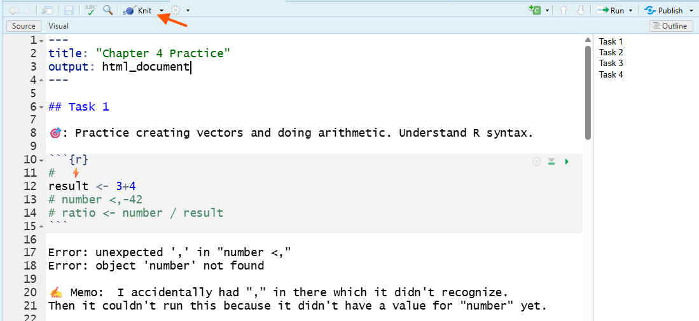
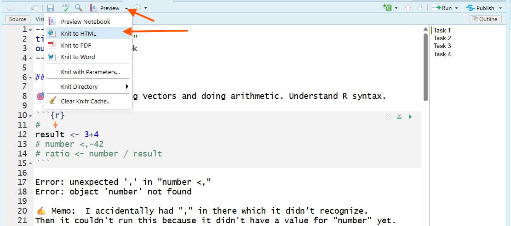

```{r setup, include=FALSE}
knitr::opts_chunk$set(echo = TRUE)
```

# Overview

In this chapter, you’ll learn how to turn your R Notebook into a shareable HTML report that clearly communicates your work as a researcher—your code, your results, and your written explanations in one place. You’ll start by improving the readability of your notebook using Markdown (a date in the document header and section headings that create an outline), then you’ll practice core R skills that researchers use constantly: summarizing vectors with built-in functions, reading help files to understand required arguments and defaults, handling missing values (`NA` and `na.rm`), and combining functions through nesting to solve multi-step problems efficiently. You’ll finish by generating an HTML version of your notebook and learning how to troubleshoot when that process fails, including how to ask an LLM for help using well-structured prompts while still documenting your own thinking. This matters now because, moving forward, your assignments will be evaluated not just on whether your code runs, but on whether your workflow is understandable and reproducible (CLO1), whether you can diagnose and fix problems (CLO2), and whether you can demonstrate responsible learning skills and AI use in your process (CLO3).

In Chapter Four you will learn how to:

- #️⃣ Format your R Notebook using Markdown

- 🗜️ Summarize vectors with built‑in, *vectorized* functions.

- 🛟 Read help files to discover arguments and defaults.

- 📦 Nest functions to build compact pipelines.

- ⚡ Handle missing values with na.rm.

- 🏗️ Structure LLM prompts using Markdown.

# Markdown

In the last chapter, you learned how to use an R Notebook (`.Rmd`) as a “reproducible thinking” document: code + output + memo-style writing in one place, in order. 

Here’s what you can do now:

1. **Create and save an R Notebook** (File > New File > R Notebook) and store it in your course folder.

2. **Recognize the YAML header** at the top of the file and edit the title.

3. **Insert code chunks** (Insert button, shortcut, or typing the fences) and understand that R code only runs inside chunks.

4. **Run chunks** using the play button, Run menu, or keyboard shortcuts and see output directly below.

5. **Memo correctly**:

- Inside a code chunk: text must start with # (otherwise R tries to run it).

- Outside a code chunk: you write normal paragraphs (no # needed).

- Use the notebook to document your learning process (goal, verify, memo, explain), including keeping errors visible (commented out) and explaining your fixes.

An R Notebook is only useful if a human can read it. In this chapter, you’ll learn the minimum Markdown skills needed to produce a clean, graded-ready notebook: a date in the **YAML Header**, a clear outline using headings, and a successful knit to HTML.

## YAML Date Field

The YAML header is the metadata “label” for your notebook. It controls document settings like title and output format. A basic YAML header looks like this:

```yaml
---
title: "Untitled"
output: html_notebook
---
```

To add a date to your notebook, edit the YAML header to include a `date:` field. 

Method A. **Hard Code**

Manually type the date you created the notebook. Include quotation marks around the date.

```yaml
---
title: "Chapter 4 Practice"
date: "January 13, 2026"
output: html_notebook
---
```

Method B. **Dynamic Date**

Use R code to generate the current date automatically each time you knit the document. The inline R expression <code>&#96;r Sys.Date()&#96;</code> retrieves the current date from your computer’s operating system. This follows the syntax: backtick (<code>&#96;</code>), then <code>r</code>, a space, <code>Sys.Date()</code>, and a closing backtick (<code>&#96;</code>). The backtick is located above the Tab key on most keyboards.

```{r echo=FALSE, results='asis'}
cat("```yaml
---
title: \"Chapter 4 Practice\"
date: \"`r Sys.Date()`\"
output: html_notebook
---
```")
```

The **Inline R** works in YAML when written exactly as above.

🎯 If you have not yet, please open a new R Notebook in your course folder named `chapter4_practice.Rmd` and add a date to the YAML header using either method. Practice this chapter's topics in your notebook. 

## Markdown Headings

Headings are how you create a structured outline. 

### Heading levels

All HTMLs in this course were created using RStudio! You can see how the headings create a structured outline and the font sizes change with heading level.

```{markdown}
# biggest heading

Type here will be in paragraph font.

## main section heading

Type here will be in paragraph font.

### subsection heading

Type here will be in paragraph font.
```


In this example, the `## Task 1` heading creates a main section heading. The Outline pane on the right lists all headings in the document, allowing you to navigate quickly between sections.

### The most common beginner mistake with #

"#" means two totally different things depending on where you type it:

**Outside a code chunk**: # creates a heading (Markdown formatting).

**Inside a code chunk**: # creates a comment (R ignores it).

___

Now that you have the basics in Markdown, let’s practice creating headings in your R Notebook as you work through R coding exercises.

# Special Values

R has several **special values** that represent non-standard data states. Two common ones are `NA` and `NaN`.

- **`NA`** ("Not Available") signals *missing* information: the value simply was not recorded.

- **`NaN`** ("Not a Number") signals an *undefined* numeric result, such as 0 divided by 0.

```{r , eval=FALSE}
# ⚡ Type this in your R Notebook
0 / 0      # Produces NaN – undefined arithmetic

NA         # Built-in constant representing a missing value
```

🗣 R prints `NA` and `NaN` in the Console so you can spot them quickly. Even though they look similar, treat them differently: `NA` means "value absent"; `NaN` means "math error".

We will mostly focus on `NA` in this chapter, but keep in mind that `NaN` is another special value you may encounter when working with numeric data.

# Built-in Functions

Many built-in summary functions take a whole vector as input and return one summary value (or a small set of values). These are summary (reduction) functions that take many values and return one value.

## Function Objects vs. Function Calls

A **function object** is the stored code that performs a task. For example, `mean` is a function object that calculates the average of a numeric vector. The stored code sums the values and divides by the number of values.

```{r}
# ⚡ Type this in your R Notebook
mean
```

🗣 Don’t worry if what prints looks cryptic. This is proof that `mean` is stored code you can inspect.

A **function call** runs the stored code. To call a function, you type the function name followed by parentheses `()`. Inside the parentheses, you must provide any **required arguments**. For example, to calculate the mean of a numeric vector, you call the `mean()` function and provide the vector as an argument. The vector is a **required argument** because the function needs it to perform the calculation. 

📜 The SYNTAX (basic): 

`mean(x)`

where `x` is the numeric vector you want to summarize.

🎯 Calculate the mean of the cursed sequence. 

```{r}
# ⚡ Type this in your R Notebook
cursed_seq <- c(4, 8, 15, 16, 23, 42)  

mean(cursed_seq)                     
```

🗣 The `mean()` function calculates the average of the numbers in the `cursed_seq` vector by summing them up and dividing by the count of numbers.

# Help Files

Nobody memorizes every argument. You look them up. `?function_name` opens the help file. The **files pane** (usually bottom-right) contains several tabs, including the **Help tab**, which displays the documentation for R functions.

## No Required Arguments

Some functions do not have a required argument. For example, the `Sys.Date()` function returns the current date without needing any input.

🎯 Call the `Sys.Date()` function to get the current date from your computer's operating system. 

```{r}
# ⚡ Type this in your R Notebook
Sys.Date()
```

🗣 The `Sys.Date()` function retrieves the current date from the system clock and returns it as a Date object.

🎯 Open the help file for the `Sys.Date()` function.

```{r, eval=FALSE}
# ⚡ Type this in your R Notebook
?Sys.Date
```

🗣 The `Sys.Date` help page opens in the **help tab** in the **files pane**. Note that `Sys.Date()` has no required arguments.

Scroll through the help file to find information about the function's usage, arguments, and examples.

- **Usage**: shows the function signature and defaults.

- **Arguments**: what each argument does.

- **Examples**: copy/run examples to learn patterns.

## Required Arguments

🎯 Open the help file for the `mean()` function. Scroll through the help file to find information about the function's usage, arguments, and examples.

- **Usage**: shows the function signature and defaults.

- **Arguments**: what each argument does.

- **Examples**: copy/run examples to learn patterns.

```{r, eval=FALSE}
# ⚡ Type this in your R Notebook
?mean   
help(mean)
```

🗣 The mean **help page** opens in the **help tab** in the **files pane**. `mean.default(x, trim = 0, na.rm = FALSE, …)` shows that `x` is a required argument, while `trim` and `na.rm` have default values.

## Default Arguments

**Default arguments** are inputs that a function uses in situations when you did not provide that argument. For example, the `trim` argument in the `mean()` function allows you to exclude a certain percentage of the lowest and highest values before calculating the mean.

The SYNTAX (with one default argument):
 
 `mean(x, trim = 0)`

🎯 Calculate the trimmed mean of the cursed sequence, removing 20% of the lowest and highest values before computing the mean.
 
```{r}
# ⚡ Type this in your R Notebook
mean(cursed_seq, trim = 0.2)  # drop 20% from each end first
```

🗣 The `mean()` function first removes 20% of the lowest and highest values from the `cursed_seq` vector, then calculates the mean of the remaining values. With 6 values and `trim = 0.2`, R trims 4 and 42, then averages 8, 15, 16, and 23.

*How can you tell which arguments are required?*

The main clue that `x` is required is that it has no `=` sign or default value next to it in the usage section. The other arguments have `=` signs, showing the default values that R will use if you don't provide your own.

Some functions use `...` (dot-dot-dot). That means “additional optional arguments may be allowed,” not required ones. For now, ignore `...` until you are more advanced.

- no `=` → required 

- `=` → default/optional

# Missing Values Workflow

The `na.rm` argument in the `mean()` function has a default value of `FALSE`, meaning that if you don't specify it, the function will include `NA` values in its calculation. 

In R, **missing values** are represented by the **special value** symbol `NA` (which stands for "Not Available"). Missing values can occur in datasets for various reasons, such as data entry errors, non-responses in surveys, or data corruption. R *will* do the operation, but the result becomes `NA` because the value is unknown (e.g., `5 + NA` returns `NA`, not an error). This is called **propagation**.

📜 The SYNTAX (with na.rm default argument):

`mean(x, na.rm = FALSE)`

where `na.rm` is a logical argument that tells the function whether to remove `NA` values before calculating the mean.

🎯 Add `NA` value(s) to the cursed sequence and calculate the mean while handling missing values.

```{r , eval=FALSE}
# ⚡ Type this in your R Notebook
cursed_seq <- c(4, 8, 15, 16, 23, 42, NA)  # includes a missing value
# cursed_seq <- c(cursed_seq, NA, NA)    # uncomment to add more missing values

mean(cursed_seq)                       # default is na.rm = FALSE → returns NA

mean(cursed_seq, na.rm = TRUE)         # Change default to TRUE to ignore missing values
```

🗣 The first `mean()` call returns `NA` because the default behavior includes missing values in the calculation. The second call uses `na.rm = TRUE` to ignore the `NA` values, allowing the function to compute the mean of the remaining numbers.

___

In many summary functions, any `NA` in the vector causes the result to be `NA` unless you tell R to remove missing values first.


| Function                    | What it does     | Example                    |
| --------------------------- | ---------------- | -------------------------- |
| `sum()`, `prod()`           | Sum/product      | `sum(x, na.rm = TRUE)`     |
| `mean()`, `median()`        | Central tendency | `mean(x, na.rm = TRUE)`    |
| `min()`, `max()`, `range()` | Extrema/range    | `range(x, na.rm = TRUE)`   |
| `sd()`, `var()`             | Spread           | `sd(x, na.rm = TRUE)`      |

___

## Detecting Missing Values

A quick yes/no check prevents surprises later in your workflow.

- `anyNA(x)` returns `TRUE` if *any* element in `x` is `NA` or `NaN`.

📜 The SYNTAX (basic):

`anyNA(x)`

where `x` is the vector you want to check for missing values.

🎯 Use `anyNA()` to check if there are any missing values in a vector.

```{r , eval=FALSE}
# ⚡ Type this in your R Notebook
Vector_NA <- c(3, 7, NA, 12)  # Our sample data – one value is missing

anyNA(Vector_NA)              # TRUE means “Something is missing!"
```

🗣  If was my data and I saw `FALSE`, I could relax; the vector has no gaps. Seeing TRUE tells me to investigate further. 

## Locating Missing Values

There are two useful functions to find the exact positions of missing values in a vector:

- `is.na(x)` returns a logical vector: `TRUE` wherever x is `NA` or `NaN`.

- `which(logical_vec)` converts `TRUE` positions into numeric indices (handy for slicing or replacing values).

🎯 Use `is.na()` and `which()` to locate missing values in `Vector_NA`.

```{r , eval=FALSE}
# ⚡ Type this in your R Notebook
is.na(Vector_NA)          # Notice that it is TRUE at position 3
```

🗣 The `is.na()` function creates a logical vector indicating which elements are missing. The third element is TRUE, indicating that the third element in `Vector_NA` is `NA`.

Vectors can be quite long, so it’s often more useful to get the numeric indices of missing values. Use `which()` to extract those indices.

```{r , eval=FALSE}
# ⚡ Type this in your R Notebook
logical_NA <- is.na(Vector_NA)
which(logical_NA)   # Returns index 3 directly
```

🗣 The `is.na()` function creates a logical vector `logical_NA` indicating which elements are missing, while the `which()` function extracts the *indices* of those missing values (see **Positional Indexing**).

# Nesting Function Calls

**Nesting function calls** is where you put one function call inside another, so the output of the inner function becomes an argument to the outer function. This works because functions return values, and R can immediately pass that returned value into the next function call.

Nesting is the simplest form of function composition. Building a multi-step transformation by combining small, single-purpose functions.

🎯 Use `sample()` to randomly select 5 numbers from the vector `travel_jumps`, then calculate the mean of those sampled numbers by nesting the `sample()` function inside the `mean()` function.

```{r , eval=FALSE}
# ⚡ Type this in your R Notebook
# Non-nesting version
travel_jumps <- seq(from = 1887, to = 2052, by = 33)   
travel_jumps_sample <- sample(travel_jumps, size = 5, replace = TRUE)
mean(travel_jumps_sample)

# Nesting version
mean(sample(travel_jumps, size = 5, replace = TRUE))  # sample then average

# Nesting version without creating the travel_jumps object
mean(sample(seq(from = 1887, to = 2052, by = 33), size = 5, replace = TRUE))

```
🗣 The first lines of code show multiple steps, each with a single purpose: create the sequence, sample the sequence, then find the mean. The Nesting version shows that the sequence is first sampled, and then the sample mean is calculated. The final Nesting version shows that the sequence is first calculated, then sampled, and finally, the sample mean is computed.  

Real work is rarely one step. Nesting is the base-R way to express that workflow without writing a ton of intermediate objects. However, nesting creates parentheses-heavy code that’s harder to read and debug. In later chapters, we will learn how to pipe multi-step workflows. 

## Locating Missing Values with Nesting

🎯 Create a large vector with some missing values using `sample()` and `c()`.

```{r , eval=FALSE}
# ⚡ Type this in your R Notebook
set.seed(100)
LargeVec <- sample(c(1:10, rep(NA, 10)))
print(LargeVec)
```

🗣 We used the `c()` function in Chapter 2. Here we have nested `c()` inside of `sample()`. We also used the `rep()` function, which is covered in more detail in a later chapter.

🎯 Use `which()` and `is.na()` to find the positions of missing values in a large vector by nesting the `is.na()` function inside the `which()` function.

```{r , eval=FALSE}
# ⚡ Type this in your R Notebook
which(is.na(LargeVec))                    # ▶ Where are the gaps?
```

🗣 The`is.na()` function creates a *logical* vector indicating which elements are missing, and the `which()` function determines the indices of those `TRUE` values. The numbers are the numeric indices (position) of the `NA` values.

## Summarizing "Missingness"

As a researcher, knowing *how much* data is missing guides your next step. 

- A single `NA` might be harmless.

- 50% missing will bias results and needs attention.

🎯 Use `sum()` and `mean()` with `is.na()` to summarize missing values in a large vector.

```{r , eval=FALSE}
# ⚡ Type this in your R Notebook
sum(is.na(LargeVec))    

mean(is.na(LargeVec))   
```
🗣 The `sum(is.na(LargeVec))` expression counts the total number of missing values in `LargeVec` by summing the `TRUE` values from `is.na()`. The `mean(is.na(LargeVec))` expression calculates the proportion of missing values by taking the mean of the logical vector returned by `is.na()`, where `TRUE` is treated as 1 and `FALSE` as 0. Fifty percent missing values yield a mean of 0.5.

## Imputation

Now that you can *detect* and *locate* gaps, you have to decide what to do about them. There is no universal “best” choice—each option makes assumptions. If you don’t know why values are missing, be cautious.

- **Option 1**: Remove missing values (complete-case analysis). Simple and common, but you may drop a lot of data (and potentially bias results).

- **Option 2**: Replace missing values with a summary value (simple imputation). Keeps the vector length the same, but it can distort the distribution (especially the variance).

___

**Option 1: Remove missing values**

🎯 Use indexing with !is.na() to keep only the observed (non-missing) values in LargeVec.

```{r , eval=FALSE}
# ⚡ Type this in your R Notebook
clean_vec <- LargeVec[!is.na(LargeVec)]   # Keeps only observed values
clean_vec
```

🗣 `is.na(LargeVec)` returns a logical vector (`TRUE` for missing, `FALSE` for present). The `!` flips it (so `TRUE` means “keep this value”). The brackets `[...]` then use that logical vector to select only the elements you want.

___

**Option 2: Impute missing values (replace NA with the mean)**

**Impute** means “fill in missing values.” A common simple imputation method is to replace missing values with the mean of the observed values.

🎯 Make a copy of LargeVec, then replace only the missing values with the mean of the observed values.

```{r , eval=FALSE}
# ⚡ Type this in your R Notebook
imputed <- LargeVec     # Make a copy to preserve original

imputed[is.na(imputed)] <- mean(imputed, na.rm = TRUE)
imputed
```

🗣 `is.na(imputed)` identifies exactly where the gaps are, and `imputed[...] <- ...` replaces only those positions. The `na.rm = TRUE` argument is required here. Without it, `mean(imputed)` would return `NA` because the input contains missing values.

🎯 Quick check: Confirm your result by comparing sum(is.na(LargeVec)) versus sum(is.na(imputed)).

```{r , eval=FALSE}
# ⚡ Type this in your R Notebook
sum(is.na(LargeVec))      # Original vector – should print number 10
sum(is.na(imputed))       # Imputed vector – should print 0
```

🗣 The first `sum(is.na(LargeVec))` call counts the number of missing values in the original vector, which should be greater than 1. The second `sum(is.na(imputed))` call counts the missing values in the imputed vector, which should be 0, confirming that all missing values have been replaced.

# Knit to HTML

When you **Knit** to HTML, RStudio creates a shareable, static report that includes your formatted headings and text, your code, and the output produced when the code runs.

This is not the same as “running a chunk”. Running a chunk uses your current R session. It can succeed even if you ran things out of order or if objects already exist in your Environment. Knitting is a full test: it runs the entire notebook top-to-bottom in a fresh session, then builds an HTML report.

📏 **Rule:** Your notebook must create every object it uses in the notebook itself (not in your Environment).

### How to Knit

RStudio UI varies. Some of you will have a **Knit button**, others will use **Preview menu** dropdown.

Option 1: **Knit button**

In the Source pane, click the **Knit button** (it looks like a ball of yarn with a knitting needle 🧶).



Option 2: **Preview menu**

In the Source pane, click the the **Preview menu** drop down button and select Knit to HTML.



___


___

When you knit, RStudio automatically does three things:

1. Starts a fresh R session (your Environment does not count).

2. Runs your notebook from top to bottom in order.

3. Produces an HTML file you can view and share.

This is why knitting is the real test of “does this notebook work?” If it knits, someone else (including future-you) can see the workflow and results without needing to open RStudio.

### Submitting the HTML File

The HTML file is automatically saved in the same folder as your R Notebook, with the same name but an `.html` extension instead of `.Rmd`. If you have not yet saved your R Notebook, RStudio will prompt you to do so before knitting.

Example:

- `chapter4_practice.Rmd`

- `chapter4_practice.html`

💡 **Tip:** the HTML opens in your browser, but the browser address is a local file path on your computer. You cannot submit a browser link.

When you open an HTML, it uses your web browser to display a nicely formatted version of your notebook, including code, output, and memos. You cannot share the HTML by sharing the web address (URL) in your browser because it is a local file on your computer. 

To submit, 📤 upload the `.html` file from your course folder (and follow any Canvas instructions your assignment page provides).

### Knit Errors

When you select to knit, the Console pane shows progress messages in the **Render tab** as R runs your notebook from top to bottom. 

A successful knit has three visible signs:

1. The Render tab shows the process finishing without an error message.

2. A browser window opens (or Viewer in File Pane) showing your notebook as a formatted web page.

3. An `.html` file appears in the same folder as your `.Rmd` file.

If knitting fails, do not guess. Do this in order:

1. Read the last error message in the **Render tab**.

2. Find the chunk that caused it (the error usually names a chunk or shows a line number).

3. Fix the first error you see. (Many later errors are just “domino effects.”)

4. Knit again.

Common reasons knitting fails:

- You wrote the code out of order, so an object exists in your Environment but is not created earlier in the notebook.

- You forgot to include setup code (creating objects, loading packages, setting a working directory, etc.).

- A chunk contains an error you didn’t notice because you never ran that chunk.

💡 **Tip:** When designing your document, knit after any meaningful formatting or code change. It’s the fastest way to catch problems early. It is easier to determine an error when it is caused by your most recent editing.

Some errors are tricky. If you get stuck, ask for help.

# Structuring LLM Prompts

One resource to troubleshooting a knit error, or many other coding problems, is using a **Large Language Model** (LLM) like ChatGPT or boisestate.ai to assist you. However, the quality of the response you get depends heavily on how you structure your prompt. The same Markdown you use in your R Notebook can also be used to structure prompts for LLMs.

## Missing Backtick

Imagine you don't know that there is a missing backtick at the end of a code chunk. You try to knit to HTML, but it fails. You ask an LLM to help you find the error.

Below are three example prompts versions: unstructured (bad), structured plain text (better), and structured Markdown (best).

### Unstructured Prompt

What do I do? I tried knitting my R notebook and it won’t work. 

|...... | 12% [unnamed-chunk-1]

processing file: Chapter_4_practice.Rmd

Error in parse():
! attempt to use zero-length variable name
Quitting from Chapter_4_practice.Rmd:12-24 [unnamed-chunk-1]
Execution halted

### Structured Plain Text Prompt

Persona: Act as a R programming tutor.

Task: Help me troubleshoot a knit error in an R Notebook (`.Rmd`). I am a beginner.

What I did: I clicked Preview > Knit to HTML in RStudio.

What happened: Knitting stopped at 12% and failed.

Error message (*copied from Render tab*):
|...... | 12% [unnamed-chunk-1]
processing file: Chapter_4_practice.Rmd
Error in parse():
! attempt to use zero-length variable name
Quitting from Chapter_4_practice.Rmd:12-24 [unnamed-chunk-1]
Execution halted

Context: The error says it quit from lines 12–24 in unnamed-chunk-1. I don’t understand what “parse” means.

What I want from you: 1. Explain what this error usually means in beginner-friendly terms. 2. Give me the most likely causes specifically for an R Notebook `.Rmd` file. 3. Give me a checklist of what to look for around lines 12–24 to fix it.

### Structured Prompt:

\# Persona: 

Act as a R programming tutor.

\# Task: 

Help me troubleshoot a knit error in an R Notebook (`.Rmd`). 

\# What I did: 

In RStudio, I clicked Preview → Knit to HTML.

\# What happened: 

Knitting stopped at 12% and failed.

\# Error message (copied exactly):

```{vbnet}
|......                                              |  12% [unnamed-chunk-1]

processing file: Chapter_4_practice.Rmd

Error in `parse()`:
! attempt to use zero-length variable name
Backtrace:
...
Quitting from Chapter_4_practice.Rmd:12-24 [unnamed-chunk-1]
Execution halted
```

\# Context: 

The error says it quit from lines 12–24 in unnamed-chunk-1. I don’t understand what “parse” means.

\# What I want from you:

1. Explain what “Error in parse()” means in plain language.

2. Tell me the top 3 most common causes in an `.Rmd` file.

3. Give me a step-by-step fix plan focused on the section lines 12–24.

___

*If you use LLMs to help with R code, always document when and how you used the tool in your R Notebook. Avoid asking LLMs to write code for you. Never copy-paste LLM-generated code unless it is used as a quote in a memo. This maintains academic integrity and helps you understand and maintain your autonomy as a learner.*

# Summary

In Chapter 4, you learned how to use an R Notebook as more than a place to run code—you learned how to produce a clear, shareable HTML report that documents your work in a way that another person (or future-you) can follow. You practiced Markdown basics that make your notebook readable, including adding a date in the YAML header and using headings to create an outline. You learned that R has special values for non-standard situations, especially `NA` (missing information) and `NaN` (undefined arithmetic), and you practiced built-in summary functions that reduce a vector to a single value. You also learned how to read R help files to determine what arguments are required versus optional defaults, using `mean()` as an example (including `trim` and `na.rm`). You built a practical missing-values workflow: detect missingness (`anyNA()`), locate missing values (`is.na()` and `which()`), summarize how much is missing (`sum(is.na(x)`) and `mean(is.na(x))`), and handle missing data by either removing missing values or imputing them with a summary value. You then practiced nesting function calls to combine steps into one expression and discussed the tradeoff between compact code and readability. Finally, you learned what it means to generate an HTML report from your notebook (running everything top-to-bottom in a fresh session) and how to troubleshoot errors when that process fails—especially formatting mistakes like broken code chunk fences—and you practiced writing structured, Markdown-based prompts to get useful help from an LLM while still documenting your own reasoning and changes.

# Chapter Terms

**Arguments**: Inputs that you provide to functions to customize their behavior. Arguments are specified within the parentheses of a function call and can modify how the function operates or what data it processes.

**Backtick**: The &#96; character (above the Tab key) used for code-related formatting and quoting. In **Markdown**, single backticks mark *inline code* and triple backticks create *fenced code blocks*; in **R Markdown**, backticks also mark *inline R code* (<code>&#96;r ...&#96;</code>), including inside YAML fields like <code>date: "&#96;r Sys.Date()&#96;"</code>, which gets evaluated when you render the document. In R, backticks can also quote non-syntactic names (e.g., names with spaces) so they can be used safely in code.

**Default Arguments**: Inputs that already have a preset value in the function definition and are used automatically when you don’t provide your own (e.g., `mean(..., na.rm = FALSE)` by default).

**Function Call**: The act of running a function by writing its name followed by parentheses, optionally supplying arguments inside (e.g., `mean(x)`). 

**Function Object**: A function stored as an R object (functions are “first-class” in R, meaning you can assign them to names, pass them to other functions, and inspect them). 

**Help Page**: Documentation for R functions and packages that provides information on usage, arguments, and examples. Accessed using `?function_name` or `help(function_name)`.

**Help Tab**: Located in the Files/Plots/Packages/Help pane, this tab provides access to R documentation, package vignettes, and search functionality to find help topics related to R functions and packages.

**HTML**: A web page file type (`.html`) written in **HyperText Markup Language** that a web browser can open and display as a formatted document. In this course, Preview/Knit/Render can create an HTML file (often `.html` or `.nb.html`) that shows your notebook’s text, code, and output in the browser; because it opens from your computer (a local `file://` path), you can’t submit it by copying the browser address. Upload the HTML file itself.

**Impute**: To replace missing or unusable values (e.g., `NA`) with substituted values—often a plausible estimate based on the observed data (such as mean/median imputation or model-based predictions)—so the dataset can be analyzed without dropping incomplete cases. Because imputed values are estimates, you should document what method you used and why.

**Inline R**: A short R expression written inside backticks with the prefix `r` (for example, <code>&#96;r Sys.Date()&#96;</code>) that is evaluated when you knit/render the document and replaced with its result in the output. Inline R is used to insert dynamic values (dates, computed statistics, labels) directly into your narrative text, and it can also be used in YAML fields like <code>date: "&#96;r Sys.Date()&#96;"</code> when supported.

**Knit**: In RStudio, the action that renders an `.Rmd` (including an R Notebook) into a finished output file (such as HTML, PDF, or Word) by running the document’s code chunks, inserting their results, and converting the document to the chosen format. Clicking the Knit button typically calls `rmarkdown::render()` in a new, clean R session, so everything needed to reproduce the result must be created or loaded in the document itself, and the output file is saved alongside the `.Rmd`.

**Knit Button**: The toolbar button in RStudio that renders an R Markdown file (`.Rmd`) into a finished output (e.g., HTML, PDF, Word) by calling `rmarkdown::render()` and running the document’s code to generate results. The output file is saved next to the `.Rmd` (same base name), and the button’s drop-down lets you choose among available output formats (shortcut: Ctrl/Cmd + Shift + K).

**Large Language Models (LLMs)**: AI systems trained on massive collections of text and code to predict and generate language, including R code and explanations. In an R-learning context, LLMs can help you brainstorm, interpret error messages, and draft code—but they can also produce plausible-sounding mistakes, so you must verify outputs, understand each line you run, and document when and how you used the tool.

**Markdown**: A lightweight plain-text formatting syntax used to write structured documents (headings, lists, links, emphasis, code) in a way that stays readable as plain text and can be rendered into formats like HTML on many platforms and tools.

**Missing Values**: Data values that are unknown or not recorded; in R they are represented by `NA` (“Not Available”). `NA` is a special missing-value indicator (with typed versions like `NA_integer_`, `NA_real_`, and `NA_character_`), and many calculations will return `NA` if any missing values are present unless you explicitly remove them (often via `na.rm = TRUE`, which defaults to `FALSE` in functions like `mean()`)

**NA**: A special constant that marks a missing value (“Not Available”)—meaning the data point is unknown or not recorded. R also provides typed missing values like `NA_integer_`, `NA_real_`, `NA_character_`, and `NA_complex_` to match the underlying data type.

**NaN**: A special numeric constant (“Not a Number”) that represents an undefined arithmetic result in floating-point math (for example, `0/0` or other invalid operations). `NaN` is non-finite (not a regular number).

**Nesting Function Calls**: Writing one function call inside another so the inner function runs first and its returned value becomes an argument to the outer function (for example, `mean(sample(x, 5))`). This works because a function call can appear anywhere an expression is allowed, and functions return a value that can be passed directly into the next call.

**Positional Indexing**: Indexing a vector using numeric positions (for example, `x[1]` for the first element or `x[c(1, 3)]` for the first and third). Positions are based on the current order of the vector.

**Preview Menu**: The drop-down attached to the Preview button in an R Notebook (`output: html_notebook`) that lets you generate a quick notebook preview and choose other render (“knit”) actions (e.g., HTML/PDF/Word). Preview renders an HTML view using outputs from chunks you’ve already run (it does not re-execute code), while knit options render the full document to the selected output format.

**Propagation**: R’s default behavior where an unknown value “spreads” through a computation. If an expression includes `NA`, the result will usually be `NA` (e.g., `5 + NA` returns `NA`) because the outcome can’t be determined without the missing information. This is often called **NA propagation**, and it’s why many summary functions return `NA` unless you explicitly remove missing values (e.g., `na.rm = TRUE`).

**Render Tab**: A temporary tab that appears in RStudio’s Console pane when you Knit/Render an R Markdown (`.Rmd`) or Quarto (`.qmd`) document. It shows the rendering log—progress messages, warnings, and errors—separately from your interactive Console, and typically includes a Stop control so you can interrupt a failed or long render.

**Required Arguments**: Inputs a function needs because they have no default value in the function definition; you must supply them in the call (or the function can’t do its job). 

**Special Values** (NA, NaN, Inf, -Inf, NULL): Reserved constants in R that represent non-standard values: `NA` for missing data, `NaN` for undefined numeric results, `Inf`/`-Inf` for positive/negative infinity, and `NULL` for “no value” (an empty/null object). In practice, use `is.na()` to detect `NA` and `NaN`, `is.nan()` to detect `NaN` specifically (not `NA`), `is.infinite()`/`is.finite()` to handle infinities and other non-finite values, and `is.null()` to test for `NULL`.

**YAML Header**: The metadata section at the top of an R Markdown or Quarto document, written between `---` lines, that controls document settings like the title, author, date, output format (HTML/PDF/Word), and options for rendering.


# 📝 Practice Space

Fill in the blanks to complete the code. 

Before you begin, make sure you have created a new R Notebook in the Source pane and saved it as `chapter4_practice.Rmd` in your course folder. 

Remember to document your tenacity on a memo if you encounter any errors while completing the tasks. 

R Notebooks can look “fine” even when they are not reproducible because your Environment may still contain objects from earlier work. Start with a clean environment and run everything in order.

## Task 1

🧭 **Help-file scavenger hunt** (required vs default)

1. 🎯 Use `?sample` to learn about the `sample()` function. 

2. In one sentence, explain how you can tell required vs default arguments from the **Usage** line.

3. Write the Usage lines exactly as they appear (copy/paste is fine), then label:

- TWO required arguments 

- TWO default arguments for `sample()` exactly as they appear in the Usage section. How you can tell which arguments are required?

🗣 ___Your explanation here___

## Task 2 

🛠 **Build a random data set**


🎯 Create `scores` as **28 values**. That is **25** random integers from **60–100** + 3 `NA`s. 

1. Use `seq()` to create 60 through 100. Store as `pool`.

2. Use sample() to draw 25 values (*with replacement*)

3. Add three `NA` to the end of `scores_numbers` using `c()`. Store as `scores`.

4. Verify that there are 28 elements in `scores`. 

```{r , eval=FALSE}
# ⚡ Type this in your R Notebook, Fill in the blanks
set.seed(1) 

pool <- ____                      # use seq() to create 60 through 100
scores_numbers <- ____            # use sample() to draw 25 values (with replacement)
scores <- c(____, NA, NA, NA)     # add 3 `NA` to the end of `scores_numbers` using `c()`

# ✅ Check the length of scores
_____(scores)                   # should print 28

```

🗣 ___Memo: articulate your learning process, connect ideas, or discuss challenges.___

## Task 3

⚠️ **Handle missing data**

🎯 Using `scores` from Task 2: 

1. Count missing values. Store as `n_missing`.

2. Compute the mean with defaults. Store as `average_raw`.

3. Compute the mean excluding `NA`s and store it as `average_score`.

4. Explain why `average_raw` behaves the way it does (use the word “default”).

```{r , eval=FALSE}
# ⚡ Type this in your R Notebook, Fill in the blanks
n_missing <- ____                 # hint: is.na() + sum()
```
```{r , eval=FALSE}
# ✅ Check the number of missing values
____        # should print 3
```

```{r , eval=FALSE}
# ⚡ Type this in your R Notebook, Fill in the blanks
average_raw <- mean(____)         # what happens?
```

```{r , eval=FALSE}
# ⚡ Type this in your R Notebook, Fill in the blanks
average_scores <- mean(____, ____)
# ✅ print the mean

```

In one sentence, explain why average_raw behaves the way it does (use the word “default”). 

🗣 ___Your explanation here___

🗣 ___Memo: articulate your learning process, connect ideas, or discuss challenges.___


## Task 4

🔎 **Locate missing values**

🎯 Using `scores` from Task 2:

1. Use `is.na()` to create a logical vector showing which elements of scores are missing; store it as `scores_is_missing`.

2. Nest `is.na()` inside `which()` to find the positions (indices) of the missing values; store as `missing_positions`.

3. Verify your result


```{r , eval=FALSE}
# ⚡ Type this in your R Notebook, Fill in the blanks
scores_is_missing <- is.na(____)

missing_positions <- which(____(____))
```
```{r , eval=FALSE}
# ✅ Check
print(____)        # should print a logical vector
print(____)        # should print indices of missing values
length(____)       # should print 3
```

🗣 ___Memo: articulate your learning process, connect ideas, or discuss challenges.___

## Task 5

📦 **Nesting functions**

🎯 Compute the mean of 5 random draws from `scores` in one line, and make sure it still works even if the draw includes `NA`. 

```{r , eval=FALSE}
# ⚡ Type this in your R Notebook, Fill in the blanks
set.seed(21)
mean_of_five <- ____   
# ✅ Check  
mean_of_five
```

🗣 ___Memo: articulate your learning process, connect ideas, or discuss challenges.___

## Task 6

🕰 **Quick time-stamp**

🎯 Use `Sys.Date()` and `Sys.time()` to create two separate objects, `today_date` and `now_time`.

```{r , eval=FALSE}
# ⚡ Type this in your R Notebook, Fill in the blanks
today_date <- ____
now_time <- ____
```

🗣 ___Memo: articulate your learning process, connect ideas, or discuss challenges.___

## Task 7

🧹 **Handling Missing Values**

🎯 Using scores from Task 2, practice two beginner-friendly strategies:

**Part A** — Remove `NA` values (“complete-case” for a vector)

1. Create `scores_clean` by keeping only the observed (non-missing) values in `scores`.

2. Verify that `scores_clean` has 3 fewer values than `scores`.

```{r , eval=FALSE}
# ⚡ Type this in your R Notebook, Fill in the blanks

scores_clean <- scores[!______(_________)]

# ✅ Checks

length(scores)          # should print 28
length(scores_clean)    # should print 25
```

🗣 In one sentence, explain what the code that creates scores_clean does (mention indexing + `!`).

🗣 ___Your explanation here___

**Part B** — Impute: replace NA with the mean of present values

1. Make a copy of `scores` named `scores_imputed` (so you don’t overwrite the original).

2. Replace the missing values in `scores_imputed` with the mean of the observed values.

3. Verify there are **0** missing values after imputation.

```{r , eval=FALSE}
# ⚡ Type this in your R Notebook, Fill in the blanks
scores_imputed <- _________

scores_imputed[____(_)] <- mean(_____, na.rm = ______)
```

```{r , eval=FALSE}
# ✅ Checks

sum(is.na(scores_imputed))     # should print 0
mean(scores_imputed)           # should print a number (not NA)
```

🗣 ___Memo: articulate your learning process, connect ideas, or discuss challenges.___

## Task 8

🗣 **Reflection**

In one sentence, explain the difference between a *function object* (e.g., mean) and a *function call* (e.g., `mean()`).

🗣 ___Your explanation here___

## Task 9

🎯 **Step 1: Sweep your Environment (start clean).**  
Click the 🧹 **broom icon** in the Environment pane to clear objects.

🎯 **Step 2: Run everything top-to-bottom.**  
Use **Run → Run All** to execute every chunk in order.

🎯 **Step 3: Save and submit.**  
After your notebook runs without errors, save your notebook (`.Rmd`) and knit to HTML (`.HTML`) for submission to Canvas, as directed. 


# References