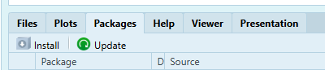

```{r setup, include=FALSE}
knitr::opts_chunk$set(echo = TRUE)
```


# Overview

In previous chapters, you learned about objects, vectors, functions, and handling missing data in R. This chapter we will learn about data management and how to import external data files (e.g., CSV, XLSX). Almost every research project begins with *bringing external data into R*. Today you will learn four common import workflows. Mastering these steps ensures that you can work with spreadsheets.


In Chapter Seven you will learn how to:

- Get the data onto your computer

- Folder structure for reproducibility

- 📊 Subset vectors by position or logical tests.

- Installing and librarying packages

- Loading base R datasets

- Loading datasets from packages

- Imported CSV via `readr::read_csv()` or GUI helper.

- Imported Excel via `readxl::read_xlsx()`.

- Make tenacity visible by keeping a record of a short what you tried anytime code fails.

# Working Directory and Paths

In Chapter 1, you learned how to use `getwd()` and `setwd()` to manage your working directory. This is crucial for importing data because R needs to know where to find the files you want to load.

It is helpful to have the file to be uploading in your working directory. This is one of the stickiest points to importing data.

```{r , eval=FALSE}
getwd()  # shows current project folder
```
Are your data files located *inside* this folder? If not, move them or `setwd("path/to/folder")`.


# Downloading Data

Downloading from Google Drive without breaking the file. 

Covers:

1. How to download (not “view”) and preserve file extensions (.csv, .xlsx).

2. Common failure modes students hit:

- Google Drive gives a .zip or a weirdly renamed file

- The file saves to Downloads and never gets moved

- The file opens in Excel and gets locked or altered

2. Required student habit: rename the file once, early, using a clear convention (e.g., chapter7_raw.csv).

## Folder Structure

1. Minimum viable structure: keep the data in the same folder as the R Notebook so relative paths are simple.

2. Chapter folder structure: move raw files into your course folder directly next to your Rmd file.

-`Intro_to_R/`
-- `chapter7_notes.Rmd`
-- `myfile.csv`
-- `myfile.xlsx`

Introduce RStudio Projects: a way to keep everything together and keep a stable working directory.

# Datasets 101

## Data Frames

“Data frame” as the chapter’s working object

Covers (minimal, first-year level):

A data frame is a rectangular table: rows = cases, columns = variables.

Reinforce: import functions usually give you a data frame (or something extremely close).

## Tibbles

Tibbles: same idea, different behavior/printing

Covers (brief + practical):

- A tibble is a modern version of a data frame with nicer printing and stricter behavior.

- Show how students might encounter it (Excel import often yields a tibble-like printout; tidyverse later will use tibbles).

- One conversion demo (optional):

`tib <- tibble::as_tibble(df)`

Promise: “You can treat these as the same for now—our exploration tools still work.”
(MLO for Learning skills)


# Import in R

## 📦 Packages refresher

In this Chapter, we will use functions from packages. You were first introduced to the concept of packages in chapter 3. A **package** is a collection of functions, data, and documentation that extends the capabilities of R. Packages are used to perform specific tasks or analyses, such as data manipulation, statistical modeling, or visualization.

You need to download the package before you can use it. You only need to install the package once. Packages, will need to be updated from time to time. In the files pane, you will see a tab called "Packages." This is where RStudio lists the packages you have installed. You can install packages by clicking the Install. 



Now you can open the R Notebook. In the main RStudio bar at the top of the screen, click File > New File > R Notebook. Remove the example writing and rename the title of your document "Assignment 5." Save the R Notebook in the correct folder as `Intro_to_R_Assignment_5`. 

Often times, you will use the function `install.packages()` to install a package. In this lesson, you will install the `readr`, `readxl`, `dslabs` package, which provides functions for reading and writing data files. Type the following code in a new code chunk and run.

```{r , eval=FALSE}
install.packages("dslabs")                # You can install one package at a time
install.packages(c("readr", "readxl"))    # You use c()
```

This code installs the `readr` and `readxl` packages. The `c()` function combines the package names into a vector, allowing you to install multiple packages at once. You can also install packages by navigating to the file pane and opening the tab "Packages." Select install and type the package name. Packages, like RStudio will need to be updated from time to time. You can click the update butten to check if you need to update any packages. 

After installing the package, you need to load it into your R session using the `library()` function. This makes the functions in the package available for use. Type the following code in a new code chunk and run.

```{r , eval=FALSE}
library(dslabs)  # For more datasets
library(readr)   # For reading CSV files
library(readxl)  # For reading Excel files
library(dslabs)  # For more datasets (along side other utilities)
```


## Package Datasets

curated “package datasets”

mtcars, iris, etc.

dslabs: data("murders")

## Read CSV

Importing a CSV with Base R (`read.csv`)

Covers:

- Why we start with Base R here: fewer moving parts; clearer mental model.

- The core code pattern (students type it twice: console then notebook):

`df <- read.csv("data/myfile.csv")`

- What `read.csv()` returns: a data frame.

`Quick “checks” immediately after import:

(Maybe Base R Version of head)

`dim(df)`, `names(df)`, `head(df)`, `str(df)`

- Common import issues to anticipate:

1. “cannot open file” (path/working directory problem)

2. weird column names or wrong separators (CSV isn’t really comma-delimited)

This is where you explicitly model Curiosity: “I don’t trust the import yet—I verify it.”

## Read Excel

Importing an Excel file (readxl::read_excel)

Covers:

- Why this requires a package: Base R doesn’t read .xlsx directly.

- Install/load once, then import:

`install.packages("readxl")`

`library(readxl)`

`df <- read_excel("data/myfile.xlsx")`

- What to do when there are multiple sheets: list sheets; choose `sheet = ...` (brief, not exhaustive)

- Why `readxl` is used: it’s designed for tabular Excel import and is broadly used in the R ecosystem.

- Common Excel-specific failures:

1. students try to import a Google Sheet link instead of a downloaded file

2. sheet names don’t match what they assume

# Data frames vs. tibbles

## Data Frames

“Data frame” as the chapter’s working object

Covers (minimal, first-year level):

A data frame is a rectangular table: rows = cases, columns = variables.

Reinforce: import functions usually give you a data frame (or something extremely close).

## Tibbles

Tibbles: same idea, different behavior/printing

Covers (brief + practical):

- A tibble is a modern version of a data frame with nicer printing and stricter behavior.

- Show how students might encounter it (Excel import often yields a tibble-like printout; tidyverse later will use tibbles).

- One conversion demo (optional):

`tib <- tibble::as_tibble(df)`

Promise: “You can treat these as the same for now—our exploration tools still work.”


## AI competency: troubleshoot imports safely

AI can help explain error messages and suggest checks.

Identify the privacy risks of certain AI systems

AI should not receive private data or human-subjects data—ever.

What’s safe to share:

- the exact error message

- your import code

last chapter: Markdown structure # 

This chapter: Markdown bold/italics with * / ** so you can emphasize constraints and context in prompts.

### Example AI prompt for troubleshooting


 


## Example memo 

## Data source citation

Open R Notebook and document the data source in a memo.

Covers:

- What to record in a memo: where it came from, who made it, date accessed, license/terms if available

- Make the point: if you can’t answer “Where did this data come from?” you shouldn’t analyze it yet.

# Summary


# Chapter Terms

**Package**: An installable collection of R code—functions, documentation, and sometimes datasets—that adds new features beyond base R. Packages are commonly installed from CRAN and then loaded with `library()` so you can use their tools in your session.

**Working Directory**: The folder on your computer that R treats as the default “home base” for the current session. When you read files (e.g., `read.csv("data.csv")`) or save outputs (e.g., `write.csv(df, "results.csv")`) using relative paths, R looks in (and writes to) the working directory unless you specify a full path. You can view or change it using Session → Set Working Directory, and you can check it with `getwd()` or change it with `setwd("path/to/folder")`.

# 📝 Practice Space

## Task 1

## Task 2

# References


