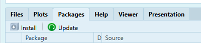

```{r setup, include=FALSE}
knitr::opts_chunk$set(echo = TRUE)
```

```{r eval=FALSE, include=FALSE}
title: "Lesson 5"
author: "by Lorraine Gaudio"
date:   "`r paste('Lesson generated on', format(Sys.Date(), '%B %d, %Y'))`"
output: 
  pdf_document:
    toc: true
    toc_depth: 2
    number_sections: true
    citation_package: natbib
    fig_caption: true
    df_print: kable # Data frame printing
    includes:
      in_header: ../assets/header.tex
    latex_engine: xelatex  # Use xelatex to support fontspec
fontsize: 12pt
geometry: margin=1in
mainfont: "Garamond" # Sets the font of the entire document
sansfont: "Gotham-Book.otf" # Set sans-serif font to Gotham Book
monofont: "Courier New" # Set monospace font to Courier New
documentclass: scrreprt
linkcolor: boisestateblue # Customizes the color of hyperlinks
urlcolor: magenta # Customizes the color of URLs
citecolor: black # Customizes the color of citations
bibliography: references.bib # Bibliography file
biblio-style: apalike                 # ⟵ natbib needs a .bst style
natbiboptions: "round,authoryear"     # round brackets, Author (Year)
 
Or
title: "Lesson 5"
author: "by Lorraine Gaudio"
date:   "`r paste('Lesson generated on', format(Sys.Date(), '%B %d, %Y'))`"
team: "Fall 2025"
output: 
  html_document: # To create an HTML document from R Markdown
    toc: true # Table of contents (TOC)
    toc_depth: 1 #(meaning that level 1, 2, and 3 headers will be included in the table of contents
    toc_float: # Float the table of contents to the left of the main document
      collapsed: false # Collapsed (defaults to TRUE) controls whether the TOC appears with only the top-level
      smooth_scroll: true # controls whether page scrolls are animated when TOC items are navigated to via mouse clicks.
    number_sections: true # Numbering starts with "#" (H1). Without H1 headers, the H2 headers ("##") will be numbered with 0.1, 0.2, and so on.
    css: ../assets/styles.css # This is the name of the CSS file to style the HTML document with Boise State Brand. The CSS file must be in the same directory as the R Markdown file.
    fig_caption: true #Whether figures are rendered with captions.
    df_print: paged # Printing data frames with interactivne scrolling
    code_folding: show # Enables you to include R code but have it hidden by default. (Show hide button)
    includes:
      in_header: ../assets/header.html
      after_body: ../assets/footer.html
```


# 💾 Welcome back to R! 

In lesson one through four you learned about objects, vectors, functions, and handling missing data in R. This week we will learn about data management and how to import external data files (e.g., CSV, XLSX). Almost every research project begins with *bringing external data into R*. Today you will learn four common import workflows. Mastering these steps ensures that you can work with spreadsheets.

To begin Lesson 5, follow these steps:

1. Open your course project for RStudio 
   
2. Create a new file. Today, let's try 📝 "R Notebook"  (File > New File > R Notebook). You'll need to first download the "R Markdown" package.

3. Type in the code provided in this document as you follow along with the video. Pause the video at anytime to answer assignment questions, dig deeper or add memo notes.

**Lesson Overview**

By the end of Lesson 5 you will be able to:

1. ⚡ Remember – Recall which R function reads CSV, XLSX

2. 🔍 Understand – Explain how RStudio’s Import Dataset dialog writes code you can reuse.

3. 🛠 Apply –  Import two file types using both GUI and script

4. 📊 Analyze – Verify that objects arrived with expected rows/columns and classes.

5. 🧠️ Evaluate – Decide when manual Files‑pane navigation is faster than typing a path.

Keep these goals in mind as you move through each section.

# 📦 Packages

So far, we have use functions that are built into R. In this lesson, we will use functions from packages. A package is a collection of functions, data, and documentation that extends the capabilities of R. Packages are used to perform specific tasks or analyses, such as data manipulation, statistical modeling, or visualization.

You need to download the package before you can use it. You only need to install the package once. Packages, will need to be updated from time to time. In the files pane, you will see a tab called "Packages." This is where RStudio lists the packages you have installed. You can install packages by clicking the Install. 



Now you can open the R Notebook. In the main RStudio bar at the top of the screen, click File > New File > R Notebook. Remove the example writing and rename the title of your document "Assignment 5." Save the R Notebook in the correct folder as `Intro_to_R_Assignment_5`. 

Often times, you will use the function `install.packages()` to install a package. In this lesson, you will install the `readr`, `readxl`, `dslabs` package, which provides functions for reading and writing data files. Type the following code in a new code chunk and run.

```{r , eval=FALSE}
install.packages("dslabs")                # You can install one package at a time
install.packages(c("readr", "readxl"))    # You use c()
```

This code installs the `readr` and `readxl` packages. The `c()` function combines the package names into a vector, allowing you to install multiple packages at once. You can also install packages by navigating to the file pane and opening the tab "Packages." Select install and type the package name. Packages, like RStudio will need to be updated from time to time. You can click the update butten to check if you need to update any packages. 

🚀 Explore and Play: What are other ways you can install packages? Create a memo note, demonstrate learning skill(s) used.

After installing the package, you need to load it into your R session using the `library()` function. This makes the functions in the package available for use. Type the following code in a new code chunk and run.

```{r , eval=FALSE}
library(dslabs)  # For more datasets
library(readr)   # For reading CSV files
library(readxl)  # For reading Excel files
library(dslabs)  # For more datasets (along side other utilities)
```

# Quick Warm-up

It is helpful to have the file to be uploading in your working directory. This is one of the stickiest points to importing data.

```{r , eval=FALSE}
getwd()  # shows current project folder
```
Are your data files located *inside* this folder? If not, move them or `setwd("path/to/folder")`.

# Base R Datasets

Base R has a datasets package with built-in data sets.  

```{r ,eval=FALSE}
data(package = "datasets")
```
A common dataset we use for this course and in assignment is 🚗 `mtcars`. Load this dataset into your environment and take a quick look. Identify what the columns contain and meaning of that content. Take a look at the options. 

```{r ,eval=FALSE}
data("mtcars")   # already in memory but this keeps the workflow explicit
?mtcars        # help file for variable descriptions
View(mtcars)   # spreadsheet view (optional)
```

# dslabs

`dslabs` is a teaching/practice data package curated for the Harvard/X data-science labs. We'll use several of these datasets in upcoming assigments as well.

```{r , eval=FALSE}
utils::data(package = "dslabs")$results[, "Item"]
```

```{r ,eval=FALSE}
data("movielens")   # already in memory but this keeps the workflow explicit
?movielens        # help file for variable descriptions
View(movielens)   # spreadsheet view (optional)
```

# Importing a CSV

🧭 GUI path is recommended for beginners.

   1. Click the *Environment* pane ▸ *Import Dataset* ▸ *From Text (readr)*.

   2. Browse to **file_name.csv** and click *Open*.

   3. Inspect preview ▶ click *Import*.

   4. RStudio inserts code like: `file_name <- read_csv("??file_path/file_name.csv")` Look at your console to see the code that was generated.
   
💡 You can select to use the `Telemarketing_RoboCall_Weekly_Data.csv` as offered in the Canvas 5 Module or use your own CSV file.

# ➤ Assignment: Part I

Replace the ___ placeholder with your code or short written answer.

## Task 1

📝 Copy the code appears in the console-copy it into your script below so future you can reproduce the import. (e.g., `file_name <- read_csv("??file_path/file_name.csv")`

RAM issue for the Excel file. 
You can limit how much of the Excel loads into R:

```{r}
# file_name <- read_csv("data/file_name.csv")
```
____

🧐 NOTICE: Use `View(file_name)` Do the column types look right? Explore this data set using the skills you developed in previous lessons. Create a memo note, demonstrate learning skill(s) used.

____

**Example for Signature Assignment: Dataset Citation & License**

Below is an example of the information to collect for the project. If you are uploading data in this assignment that you plan to use for the project, you can record that information in your assignment document.

*You can use generative AI to aid in creating the dataset citation. You must verify that the information generated is correct.*

1. Source data (primary citation)

- Title: Consumer Complaints Data — Unwanted Calls

- Creator/Organization: Federal Communications Commission (Consumer & Governmental Affairs)

- Year & Version: Ongoing (began 2014-10-31; updated regularly). Accessed: 2025-09-21

- URL: [https://opendata.fcc.gov/Consumer/Consumer-Complaints-Data-Unwanted-Calls/vakf-fz8e](https://opendata.fcc.gov/Consumer/Consumer-Complaints-Data-Unwanted-Calls/vakf-fz8e)

- License: U.S. Federal Government data. Works of the U.S. Government are generally public domain in the U.S. under 17 U.S.C. §105, unless otherwise noted on the dataset page. (Check the FCC Open Data page for any specific terms.) 

- What it contains: Individual informal consumer complaints about unwanted calls (telemarketing/robocalls), with fields selected by the consumer; the FCC does not verify the facts alleged. 

- How it was collected: Complaints submitted via the FCC Consumer Complaints Center and published through the FCC Open Data portal/APIs. 
Federal Communications Commission

- Why I chose it / fit to requirements: Contains numeric (counts, dates/times → continuous/discrete), binary (e.g., yes/no indicators), categorical (issue types), and free-text (complaint descriptions).

2. Packaged derivative (download source - secondary citation)

- Title: telemarketing (v0.0.1) — An attempt at Anti-Telemarketing Warfare

- Creator: Shale Craig

- Year & Version: 2015; release v0.0.1 (Oct 23, 2015); repository archived Feb 4, 2025. Accessed: 2025-09-21

- URL: [https://github.com/shalecraig/telemarketing](https://github.com/shalecraig/telemarketing)

- License: MIT (repository/code). Note: The phone-number data inside the VCF/CSV is still governed by the FCC dataset’s terms above. 

- What it contains: A CSV snapshot of phone numbers extracted from FCC robocall complaints, intended for contact-list blocking. 

- How it was collected: Numbers aggregated from the FCC “Unwanted Calls” dataset and exported to VCF. 

3. (Optional) “Found via” reference

- Data Is Plural — 2015-10-28 edition: “Data-shaming the robocallers.” Highlights the FCC complaints data and tools derived from it. Include only if you discovered the dataset through this newsletter.

____

# Importing an Excel (XLSX)

🌟 Repeat the steps but choose *From Excel* in the dialog.

Code produced will resemble: `file_name <- read_xlsx("??file_path/file_name.xlsx")`

💡 You can select to use the `Most_Recent_Data_by_Field_of_Study.xlsx` as offered in the Canvas 5 Module or use your own XLSX file.

# ➤ Assignment: Part II

Replace the ___ placeholder with your code or short written answer.

## Task 2

📝 Copy the code appears in the console-copy it into your script below so future you can reproduce the import. (e.g., `file_name <- read_xlsx("??file_path/file_name.xlsx")`)

```{r eval=FALSE}
file_name <- read_xlsx("data/file_name.xlsx")
```

For huge files, you can call the the sheet name to aid loading speed and include a row range to limit the amount of data pulled into R.

```{r eval=FALSE}
#install.packages("here")
library(here)

# read a subset by sheet name + range
df <- read_excel(
  here("data", "file_name.xlsx"),
  sheet = "name_of_sheet",
  range = "A1:Z10000"
)
```
____

🧐 NOTICE: Explore this data set using the skills you developed in previous lessons. Create a memo note, demonstrate learning skill(s) used.

🔍 Look deeper: What are the differences between a CSV and XLSX files? Create a memo note, demonstrate learning skill(s) used.

____

**Example for Signature Assignment: Dataset Citation & License**

Below is an example of the information to collect for the project. If you are uploading data in this assignment that you plan to use for the project, you can record that information in your assignment document.

- Title: College Scorecard — Most Recent Data by Field of Study

- Creator/Organization: U.S. Department of Education, Office of Planning, Evaluation and Policy Development (OPEPD)

- Year & Version: “Most recent” compilation; ZIP last updated 2023-04-19; Accessed: 2025-09-21

- URL: [https://collegescorecard.ed.gov/data](https://collegescorecard.ed.gov/data)

- License: U.S. Government work (public domain in the U.S. under 17 U.S.C. §105), unless otherwise noted on the dataset page.

- What it contains (2–3 sentences): Program/field-of-study–level metrics used in College Scorecard, such as enrollment, completion, debt/repayment, and post-completion earnings, compiled as the latest available value for each metric regardless of award year.

- How it was collected (1–2 sentences): Aggregated from federal reporting by institutions, federal financial aid data, and tax information, processed and published by the U.S. Department of Education via the College Scorecard program.

- Why I chose it / fit to course requirements: Includes numeric (both discrete and continuous), binary, categorical, and free-text descriptors, and is openly accessible for independent verification and reuse.

- (Optional) Found via: Data Is Plural newsletter.

____

# Save and Upload

1. You will be submitting **both** the notebook document and any data file(s) not provided in course materials.

💾 **Always save the R documents before closing.**

2. Find the assignment in this week's module in Canvas and upload **both** the Notebook RMD and the workspace file.

# Today you practiced:

- Installing and librarying packages

- Loading base R datasets

- Loading datasets from packages

- Imported CSV via `readr::read_csv()` or GUI helper.

- Imported Excel via `readxl::read_xlsx()`.

____

🎯 Great job! Uploading data files is a crucial skill for data analysis. In our next lesson, we'll learn about subsetting, extraction, and insertion in data frames. 
