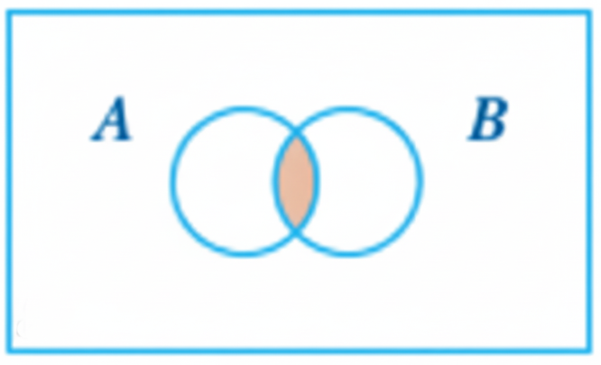
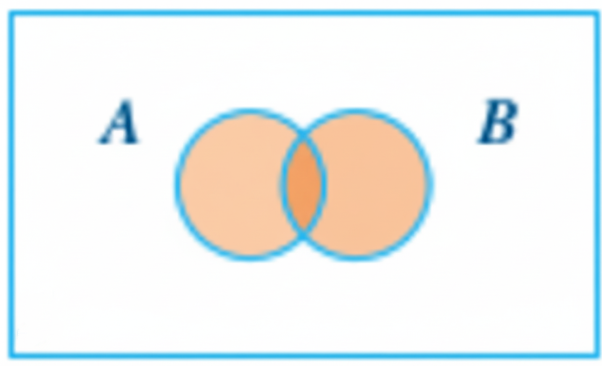

```{r setup, include=FALSE}
knitr::opts_chunk$set(echo = TRUE)
```

```{r eval=FALSE, include=FALSE}
title: "Lesson 7"
author: "by Lorraine Gaudio"
date:   "`r paste('Lesson generated on', format(Sys.Date(), '%B %d, %Y'))`"
output: 
  pdf_document:
    toc: true
    toc_depth: 2
    number_sections: true
    citation_package: natbib
    fig_caption: true
    df_print: kable # Data frame printing
    includes:
      in_header: ../assets/header.tex
    latex_engine: xelatex  # Use xelatex to support fontspec
fontsize: 12pt
geometry: margin=1in
mainfont: "Garamond" # Sets the font of the entire document
sansfont: "Gotham-Book.otf" # Set sans-serif font to Gotham Book
monofont: "Courier New" # Set monospace font to Courier New
documentclass: scrreprt
linkcolor: boisestateblue # Customizes the color of hyperlinks
urlcolor: magenta # Customizes the color of URLs
citecolor: black # Customizes the color of citations
bibliography: references.bib # Bibliography file
biblio-style: apalike                 # ⟵ natbib needs a .bst style
natbiboptions: "round,authoryear"     # round brackets, Author (Year)
 
Or
title: "Lesson 7"
author: "by Lorraine Gaudio"
date:   "`r paste('Lesson generated on', format(Sys.Date(), '%B %d, %Y'))`"
team: "Fall 2025"
output: 
  html_document: # To create an HTML document from R Markdown
    toc: true # Table of contents (TOC)
    toc_depth: 1 #(meaning that level 1, 2, and 3 headers will be included in the table of contents
    toc_float: # Float the table of contents to the left of the main document
      collapsed: false # Collapsed (defaults to TRUE) controls whether the TOC appears with only the top-level
      smooth_scroll: true # controls whether page scrolls are animated when TOC items are navigated to via mouse clicks.
    number_sections: true # Numbering starts with "#" (H1). Without H1 headers, the H2 headers ("##") will be numbered with 0.1, 0.2, and so on.
    css: ../assets/styles.css # This is the name of the CSS file to style the HTML document with Boise State Brand. The CSS file must be in the same directory as the R Markdown file.
    fig_caption: true #Whether figures are rendered with captions.
    df_print: paged # Printing data frames with interactivne scrolling
    code_folding: show # Enables you to include R code but have it hidden by default. (Show hide button)
    includes:
      in_header: ../assets/header.html
      after_body: ../assets/footer.html
```


# 🛠 More Subsetting in R! 

In lesson six, you learned about subsetting, extraction, and insertion in data frames. This week, we cover advanced subsetting in base R. Clean analysis starts with pulling out the exact rows and columns you need. R’s logical operators (`>`, `<`, `==`, `!=`, `&` , `|`, `%in%`) and how they power precise subsetting with brackets `[rows , cols]`.

To begin Lesson 7, follow these steps:

1. Open your course project for RStudio 
   
2. Create a new file. Today, let's continue to use 📝 "R Markdown" (File > New File > R Markdown).

3. Type in the code provided in this document as you follow along with the video. Pause the video at anytime to answer assignment questions, dig deeper or add memo notes.

**Lesson Overview**

By the end of Lesson 7 you will be able to:

1. ⚡ Remember – List R’s primary logical operators and their purpose.

2. 🔍 Understand – Describe how logical tests return `TRUE`/`FALSE`/`NA`.

3. 📍 Apply – Use logical conditions inside `[ ]` and `which()` to subset

4. 📊 Analyze – Compare results from different operators or thresholds.

5. 🛠️ Evaluate –Choose operators and subsetting strategy for a goal.

Keep these goals in mind as you move through each section.

# Quick Warm-up

**Loading Data**

1. 🚗  We will use the built-in `mtcars` dataset for this lesson. View it for context.

```{r , eval=FALSE}
data("mtcars")
?mtcars      # help file (opens in Help tab)
View(mtcars) # spreadsheet view (top-left pane)
```
2. 📖 Review: Subsetting template

📜 The SYNTAX: `object[ ROWS , COLS ]`

- Leave `ROWS` blank → keep all rows.

- Use negative indices in `COLS` to drop columns by position.

## Excluding Columns and Rows

**Memoing** 

1. Write a 🎯 Clear goal, ❓ Question,  or 💬 Prediction

2. ⚡ Test (run code)

3. ✅  Verify (check results)

4. 🗣 Explain: State what happened and why

Example: 

1. 💬 Prediction: What will `mtcars[ , -c(8, 9)]` return? Type your prediction and rational before running the code. 

2. ⚡ Test it: Type the following code in a new code chunk and run.

```{r , eval=FALSE}
# ⚡ Test 
no_cat <- mtcars[ , -c(8, 9)]   
# ✅  Verify
head(no_cat)
```

🗣 Explain: What exactly happened? I 🧐 NOTICE that the row names (car models) are untouched but some columns are missing. Specifically `vs` and `am` columns are missing.


✍️ Learning Skill Practice: fill in the blank prompt 

Write a 🎯 Clear goal: 

```{r eval=FALSE}
# Your turn: drop any TWO columns by position from mtcars
# ⚡ Test (run code)
brief_demo <- mtcars[ , -c(___, ___)]
# ✅  Verify
head(brief_demo)
```

🗣 Explain: What exactly happened?

## $: Accessing Columns

- `$` extracts a single column as a vector. 

- 📜 The SYNTAX: `dataframe$column_name`

Type the following code in a new code chunk and run.

```{r , eval=FALSE}
mtcars$mpg  # miles per gallon column as a vector
```

# Logical Operators: The Key to Subsetting

👉 Up Next! Logical operators: the key to subsetting data frames.

| Operator | Meaning | Example  |
| -------- | ------- | ------------|
| `>`      |greater than| mpg **`>`** 20|
| `<`      |less than| mpg **`<`** 15|
| `==`     | equal to | am **`==`** 1|
| `>=`     |greater *or* equal|mpg **`>=`** 25|
| `<=`     |less *or* equal   |mpg **`<=`** 15|
| `!`      | not     | **`!`**(gear %in% c(3,4))  |
| `!=`     | not equal to| gear **`!=`** 4|
| `&`      |  and    | x > 2 **`&`** y == "a" |
| `|`      |  or     | cyl == 4 **`|`** cyl == 8 |
| `%in%`   | in set  | region **`%in%`** c("West", "South") |


## Equality and Inequality

Let's practice some of these operators. 

`==` asks “is exactly equal to?”   

`!=` asks “is NOT equal to?”.

Both return a logical vector. Type the following code in a new code chunk and run.

```{r , eval=FALSE}
# ➡ TRUE where cylinders equal 6
mtcars$cyl == 6       
```

This returns a logical vector with `TRUE` where the number of cylinders is exactly 6 and `FALSE` otherwise.

Type the following code in a new code chunk and run.

```{r , eval=FALSE}
# ➡ TRUE where gears are NOT 4
mtcars$gear != 4       
```

This returns a logical vector with `TRUE` where the number of gears is anything but 4 and `FALSE` otherwise.

❓ Question: How many cars in the dataset have `mpg ≤ 15?` Type the following code in a new code chunk and run.

```{r , eval=FALSE}
# ⚡ Test 
sum(mtcars$mpg <= 15)
```

📝 Learning Skill Memo: What exactly is sum() counting when given a logical test? Explain your answer.

a. The rows `<= 15` in `mtcars$mpg`.

b. The columns where the index is greater than or equal to 15.

c. The `TRUE` values where the test `<=` is satisfied for `mpg`.

d. The `FALSE` values where the test `<=` is satisfied for `mpg`.

🚀 **Explore and Play**: 🤔 Create your own questions based on the available data in `mtcars` *then* 📝 Write the script to answer those questions. Create a memo note, demonstrate learning skill(s) used.

❓ Question: Pose a question

```{r eval=FALSE}
#⚡ Test 
## Pick the column, logical operator, value within the range of the selected column
mtcars$___ ___ ___ 
```

🗣 Explain: What happened and why?

## Using Logical Tests Inside `[ ]`

1. 👉 Using these logical (`TRUE`/`FALSE`) vectors created inside `[ ]` keeps only rows that satisfy the test. 

🎯 Clear goal: Let's keep only rows that contain six cylinders. We'll rename the dataframe to `six_cyl` for to keep mtcars intact. Type the following code in a new code chunk and run.

```{r , eval=FALSE}
# ⚡ Test: cars with exactly 6 cylinders
six_cyl <- mtcars[mtcars$cyl == 6, ]
# ✅  Verify
head(six_cyl)
```

🗣 Explain: There are 6 cars with 6 cylinders. 

✍️ Practice: fill in the blank prompt

You try to design your own subsetting operation.

🎯 Clear goal:  Write an example that selects only cars with average mile per gallon over (>) 22.

```{r , eval=FALSE}
# ⚡ Test: c cars with average mile per gallon over 22.
high_mpg <- mtcars[ __________ ,]
# ✅  Verify
unique(high_mpg$mpg)
```

🗣 Explain: (1 sentence): What was the result of this subsetting operation? Why?

2. 🤔 Do you remember how negative column indices work? Let's apply that skill here.

🎯 Clear goal: Let's write code that will keep rows with hp >= 100, then DROP columns 3, 5, and 8:9 by POSITION. Type the following code in a new code chunk and run.

```{r, eval=FALSE}
# ⚡ Test: 
selection <- mtcars[mtcars$hp >= 100, -c(3, 5, 8:9)]
# ✅  Verify
head(selection)
```

```{r, eval=FALSE}
# ✅  Verify
ncol(selection) == ncol(mtcars) - length(c(3,5,8:9))
```

🗣 Explain: "`-c(3,5,8:9)`" drops columns 3, 5, 8, 9. This keeps other variables.

```{r, eval=FALSE}
?all   # open help on all() function
# ✅  Verify
all(selection$hp >= 100) # verify all rows meet the condition
```
🗣 Explain: `selection` contains only rows where hp is greater than or equal to 100.

## `which()`: From Logical to Position

`which()` converts `TRUE` positions to row indices (numbers). This avoids errors when `NA` is present and is handy for re‑use. 

🎯 Clear goal: Build an index for fast cars (quarter-mile time `< 16 sec`) then use the index to view these rows and only the `mpg` and `qsec` columns.

. Type the following code in a new code chunk and run.

```{r , eval=FALSE}
# ⚡ Test: 
rows_fast <- which(mtcars$qsec < 16)  # quarter‑mile < 16 sec
# ✅  Verify
rows_fast  # inspect the row positions
```

🗣 Explain: There are 5 cars with quarter-mile time under 16 seconds.

```{r , eval=FALSE}
# ⚡ Test
fast_cars <- mtcars[rows_fast, c("mpg", "qsec")]  # inspect subset
# ✅  Verify
fast_cars
```

`fast_cars` is a subset data frame of `mtcars` with 5 rows and 2 columns (`mpg` and `qsec`).

```{r , eval=FALSE}
 # 🧐 Evaluate fast_cars dataframe:
rownames(fast_cars) 
range(fast_cars$mpg)
```

🗣 Explain: These cars are fast (`qsec < 16`) and have mpg ranging from 13.3 to 19.7.

# Combining Conditions

## And `&`

Suppose we have two events: A and B. The "And" operator `&` returns `TRUE` only if **both** event A and event B are **true**. It returns `FALSE` if either event A or event B (or both) are false. The "and" is used to combine two or more conditions where all conditions must be true.

```{r , out.width='40%', fig.align='center', alt.cap='Venn diagram showing "and" operation', echo=FALSE}

```
🎯 Goal: automatic (`am == 0`) *and* average miles per gallon is less than or equal to 22.

Type the following code in a new code chunk and run.

```{r , eval=FALSE}
# ⚡ Test
auto_mpg_22_or_less <- mtcars[ mtcars$am == 0 & mtcars$mpg <= 22 , ]
```

```{r , eval=FALSE}
# ✅ Verify 
head(auto_mpg_22_or_less)
```


```{r , eval=FALSE}
# ✅ Verify 
all(auto_mpg_22_or_less$am == 0)
```


```{r , eval=FALSE}
# ✅ Verify 
all(auto_mpg_22_or_less$mpg <= 22)
```


```{r , eval=FALSE}
# ✅ Verify 
nrow(auto_mpg_22_or_less)
```

🗣 Explain (1–2 sentences): Why is `&` the correct operator for the creation of `auto_mpg_22_or_less`? Because we want cars that are both automatic and have mpg less than or equal to 22.

## Or `|`

Suppose we have two events: A and B. The "Or" operator `|` returns `TRUE` if either **event A** is true, **event B** is true, **or both** events are **true**. It only returns `FALSE` if both events are false. "Or" is inclusive and is used to combine two or more conditions where at least one condition must be true.

```{r , out.width='40%', fig.align='center', alt.cap='Venn diagram showing inclusive "or" operation', echo=FALSE}

```


🎯 Goal: cars with 4 *or* 8 cylinders.

Type the following code in a new code chunk and run.

```{r , eval=FALSE}
# ⚡ Test
four_or_eight <- mtcars[mtcars$cyl == 4 | mtcars$cyl == 8, ]
```


```{r , eval=FALSE}
# ✅ Verify 
head(four_or_eight)
```


```{r , eval=FALSE}
# ✅ Verify 
unique(four_or_eight$cyl)
```

🗣 Explain (1 sentence): What does `|` do in this context? We want cars that have either 4 or 8 cylinders.

⚠️ Common Pain Point: using `|` where you meant `&` (or vice‑versa). Think in words first: 

- "I want rows that are both A **and** B" are TRUE at the same time. 👉 use `&` 

- "I want rows where at least one (A **or** B") is TRUE. 👉 use `|`

## Membership `%in%`

The `%in%` operator tests if values belong to a set (vector). It is a shorthand for multiple `|` conditions. This is the scalable OR operator when you have many values to match.

🎯 Goal: Same task as above with `%in%`. Type the following code in a new code chunk and run.

```{r , eval=FALSE}
# ⚡ Test
four_or_eight_2 <- mtcars[mtcars$cyl %in% c(4, 8), ]
```

⚖️ Compare `nrow(four_or_eight)` to `nrow(four_or_eight_2)`.

```{r , eval=FALSE}
# ✅ Verify: same number of rows as the | version
nrow(four_or_eight) == nrow(four_or_eight_2) 
```

🗣 Explain (1 sentence): When matching many categories, `%in%` is easier than chaining many `|`statements.

## Putting It All Together

In this section, we'll combine multiple conditions with `&` and `|` or `%in%`. 

1. 👉 Pro Tip: Use parentheses when mixing `&` and `|` to make intent explicit.

🎯 Goal: Pick automatic transmission cars and either are very efficient (`mpg ≥ 25`) or very light (`wt < 2.5`, i.e., < 2500 lb).

💬 Prediction: The parentheses will change which rows are selected. Type the following code in a new code chunk and run.

```{r , eval=FALSE}
# ⚡ Test (write with and without parentheses)
maybe_wrong <- mtcars[ mtcars$am == 1 & mtcars$mpg >= 25 | mtcars$wt < 2.5 , ]

intended <- mtcars[ mtcars$am == 1 & (mtcars$mpg >= 25 | mtcars$wt < 2.5) , ]
```
⚖️ Compare the number of rows in `maybe_wrong` to `intended`.

```{r , eval=FALSE}
# ✅ Verify
nrow(maybe_wrong) == nrow(intended)
```

🗣 Explain (1–2 sentences): Why do parentheses matter when mixing `&` and `|`? Parentheses clarify the order of operations. Without parentheses, the expression is evaluated left to right, which can lead to unintended results. With parentheses, we ensure that the conditions within them are evaluated first.

2. 🎯 Goal: Pick cars that weigh < 3,000 lb, have horse power between 110 and 180, and cylinders {4,6}.

```{r , eval=FALSE}
# ⚡ Test
light_midpower <- mtcars[mtcars$wt < 3 &           
                           mtcars$hp >= 110 & mtcars$hp <= 180 &
                           mtcars$cyl %in% c(4, 6), ]
```


```{r , eval=FALSE}
# ✅ Verify
head(light_midpower)
```


```{r , eval=FALSE}
# ✅ Verify
range(light_midpower$hp)
```

The code selected rows with horsepower between 110 and 180.

```{r , eval=FALSE}
# ✅ Verify
unique(light_midpower$cyl)
```

The code selected rows with 4 or 6 cylinders.

```{r , eval=FALSE}
# ✅ Verify
all(light_midpower$wt < 3)
```
The code selected rows with weight under 3 (i.e., under 3000 lbs).

# 📝 Practice Space

Optional fill in the blank prompts to earn learning skill points. (This is a good choice if you have not done much memoing in this assignment thus far.)

 🎯 Goal: Pick the transmission: `am ==` ___ (recall that 0 = automatic, 1 = manual) and pick a threshold for `qsec` (smaller = faster), e.g., < 17

```{r , eval=FALSE}
# ⚡ Test
## Replace the blanks and run:
sporty <- mtcars[mtcars$am == __ & mtcars$qsec < __ , ]
# ✅ Verify  (write your own check)
____
```

🗣 Explain (1–2 sentences): 

🚀 Explore and Play: Create your own goal based on the available data in `mtcars` *then* write the script to answer that question. Create a memo note, demonstrate learning skill(s) used.

🎯 Goal:

```{r}
# ⚡ Test

# ✅ Verify  

```
🗣 Explain (1–2 sentences): 

# ➤ Assignment

Now it's your turn to practice creating and using vector objects. Follow the tasks below to complete part of the **technical skill practice assignment**.

1. Work through each task in order. Replace the ___ placeholder with your code or short written answer.

2. Run each completed line to be sure no errors appear and objects show in the Environment.

3. When finished, save your workspace and submit this R Markdown file (RMD) plus the .RData file.

**NGO Health Pilot** 🌍💉

Imagine your nonprofit received 100 vaccine coolers and one charter flight. You must assemble a shortlist of countries for a health-equity pilot within the next few weeks. Use dslabs::gapminder to (a) focus on specific regions, (b) filter by need indicators, and (c) apply a simple feasibility window based on population size.

## Task 0

🚀 Setup & Orientation

Load the data, read the help page, and become familiar with the `gapminder` dataset.

```{r ,eval=FALSE}
# install.packages("dslabs")  # uncomment if first time

# TODO 0-A: Load the package and data
___   # use library() to load the package
___   # use data() to load the dataset "gapminder"

___   # pull up gapminder in the help window
```


```{r ,eval=FALSE}
___(___)       # use colnames() to list names of the columns in gapminder
```


TODO 2-C: How many rows are in gapminder?
__


## Task 1 

📅 Pick a Year

Choose ONE specific year present in the data and store it:

1. Use unique() to print the available `years` in `gapminder`.

```{r ,eval=FALSE}
# TODO 1‑A: list years
unique(___$___)   # see unique `years` in `gapminder`
```

```{r , eval=FALSE}
# TODO 1‑A: Select ONE year
target_year <- ___   # must be a single year of gapminder
```

✍️ MEMO (1–2 sentences): “I chose target_year = ___ because ___.”

## Task 2 

🎯 Focus the Pool (`year` `&` `region` with `%in%`)

First, find the exact region names; then keep only rows from your chosen year and your two target regions.

1. Identify the `unique` `region` options in `gapminder`.

```{r , eval=FALSE}
# TODO 2-A: Show all region options
___(___$___)     
```

*Use this to select two regions. Copy exact names.*

2. Create `focus_pool` that keeps rows from your `target_year` AND restricts to two regions you want to prioritize. Use unique(`gapminder$region`) above to copy region names exactly.

```{r , eval=FALSE}
# TODO 2-B: Create focus_pool using year AND region membership
focus_pool <- gapminder[ ___ == ___ & ___ %in% c("___","___") , ]
```


```{r , eval=FALSE}
# TODO 2-C: How many rows are in focus_pool?
___
```

Compare the number of rows in `gapminder` with the number of rows in `focus_pool`

```{r , eval=FALSE}
# TODO 2-D: Preview a few informative columns
___       # Hint: head(focus_pool[, c("country", ...)])
```

✍️ MEMO (1–2 sentences): Describe what `%in%` and `&` are doing here, and why you used `$` with column names.

EXPLANATION: "___"

## Task 3

🗂 Negative Column Indices (Drop Columns by Position)

Create a simpler briefing table `brief_sheet` by dropping exactly two columns by position (not by name). Choose any two you don’t need to discuss need.

```{r , eval=FALSE}
brief_sheet <- focus_pool[ , -c(___, ___) ]
head(brief_sheet)
```

✍️ MEMO: Explain how negative indices work for column selection.

EXPLANATION: “___”

## Task 4

🔢 Quick Check with Inequality

How many countries in `focus_pool` have `life_expectancy` >= 70? 60?

```{r , eval=FALSE}
sum(___$___ >= ___)
```

✍️ MEMO (1 sentence): What value is `sum()` counting in this context?

EXPLANATION: “___”

## Task 5

🧪 Need Screen (Combine Conditions with `&`)

1. Build `needs_screen` (keep all columns) using these **AND** conditions:

`life_expectancy <= a` where `a` is an appropriate number for your data set. (a = 70 worked for me)

`infant_mortality >= b` where `b` is an appropriate number for your data set. (b = 35 worked for me)

`fertility >= c` where `c` is an appropriate number for your data set. (c = 2 worked for me)

```{r , eval=FALSE}
# TODO 5-A: Create needs_screen using three AND-ed conditions
needs_screen <- focus_pool[ ___ <= ___ & ___ >= ___ & ___ >= ___ , ]
```

🛠 Break Things! Learning Skills challenge: What would happen if you used `|` instead of `&` here?

2. Print the number of rows and show a view of only key columns

```{r , eval=FALSE}
# TODO 5-B: How many rows survived? Show a compact view of key columns.
___
```

```{r , eval=FALSE}
# TODO 5-B: Show a compact view of key columns.
___     # Hint needs_screen[ , c("country", ...)] 
          # or needs_screen[ , -c("population", ...)]
```

## Task 6

🔁 `|` vs `%in%` (Same Result, Different Syntax)

1. Show that filtering the same two regions with `|` is equivalent to using `%in%`.

```{r , eval=FALSE}
# TODO 6-A: 
## Recreate the two-region filter using | (OR)
A_or_B <- gapminder[ ___ == ___ & (___ == "___" | ___ == "___") , ]

## Recreate the two-region filter using %in%
in_set <- gapminder[ ___ == ___ & ___ %in% c("___","___") , ]
```

2. Do both approaches return the same number of rows?

```{r , eval=FALSE}
# TODO 6-B:
nrow(____) == nrow(____)
```
 
✍️ MEMO (1–2 sentences): Briefly compare `|` and `%in%`. When is `%in%` preferable?

EXPLANATION: "___"

## Task 6

📍 Feasibility with `which()` (Population Window)

From `needs_screen`, keep countries with population between 2 million and 50 million (inclusive). Use `which()` to convert the logical test to row positions, then subset. (TIP: If these values (2e6 and 5e7) return nothing, you can tweak them to find a solution.)

```{r , eval=FALSE}
# TODO 7-A: Build an index of matching rows with which()
idx <- which( ___$population >= 2e6 & ___$population <= 5e7 )
```


```{r , eval=FALSE}
# TODO 7-B: Subset rows using idx to create shortlist
shortlist <- ___[ ___ , ]
```

How many countries are in shortlist? Which regions appear in shortlist?

```{r , eval=FALSE}
# TODO 7-C: Display a compact table of shortlist (choose a few columns)
___

```

✍️ MEMO  (1–2 sentences): What does `which()` return, and why might it be useful to store these positions?
 
EXPLANATION: "___"


 
# Save and Upload

0. Make sure your script runs from top to bottom without errors.

1. You will be submitting **both** the R Markdown and the workspace file. The workspace file saves all the objects in your environment that you created in this lesson. You can save the workspace by running the following command in a code chunk of the R Markdown document:

```{r , eval=FALSE}
save.image("Assignment7_Workspace.RData")
```

Or you can click the "Save Workspace" button in the Environment pane. 

💾 **Always save the R documents before closing.**

2. Find the assignment in this week's module in Canvas and upload **both** the RMD and the workspace file.

3. Learning Skill Option: save and submit a .rds file of your final shortlist object. This is a common way to save R objects for sharing or future use.

```{r , eval=FALSE}
saveRDS(shortlist, file = "shortlist.rds")
```

# Today you practiced:

- Learned R’s logical operators and how they create `TRUE`/`FALSE` vectors.

- Practiced negative indices to drop columns.

- Used `which()` to convert logical results into row positions.

- Combined conditions with `&`, `|`, and `%in%` for flexible subsetting.

- Built step‑by‑step filters to answer targeted questions about `mtcars` and `gapminder`.

🚀 Keep experimenting! Logic is the engine behind every data filter you will ever write in R. In our next lesson, we explore subsetting with the with `dplyr` package. 
