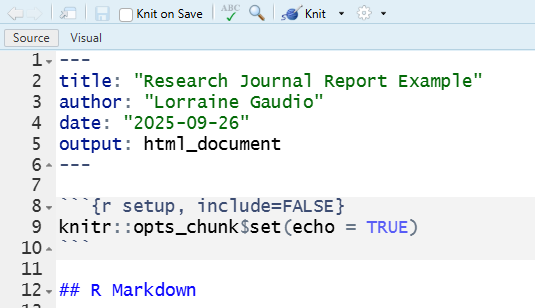

```{r setup, include=FALSE}
knitr::opts_chunk$set(echo = TRUE)
```

```{r eval=FALSE, include=FALSE}
title: "Dataset declaration"
author: "by Lorraine Gaudio"
date:   "`r paste('Lesson generated on', format(Sys.Date(), '%B %d, %Y'))`"
output: 
  pdf_document:
    toc: true
    toc_depth: 2
    number_sections: true
    citation_package: natbib
    fig_caption: true
    df_print: kable # Data frame printing
    includes:
      in_header: ../assets/header.tex
    latex_engine: xelatex  # Use xelatex to support fontspec
fontsize: 12pt
geometry: margin=1in
mainfont: "Garamond" # Sets the font of the entire document
sansfont: "Gotham-Book.otf" # Set sans-serif font to Gotham Book
monofont: "Courier New" # Set monospace font to Courier New
documentclass: scrreprt
linkcolor: boisestateblue # Customizes the color of hyperlinks
urlcolor: magenta # Customizes the color of URLs
citecolor: black # Customizes the color of citations
bibliography: references.bib # Bibliography file
biblio-style: apalike                 # ⟵ natbib needs a .bst style
natbiboptions: "round,authoryear"     # round brackets, Author (Year)
 
Or
title: "Dataset declaration"
author: "by Lorraine Gaudio"
date:   "`r paste('Lesson generated on', format(Sys.Date(), '%B %d, %Y'))`"
team: "Fall 2025"
output: 
  html_document: # To create an HTML document from R Markdown
    toc: true # Table of contents (TOC)
    toc_depth: 1 #(meaning that level 1, 2, and 3 headers will be included in the table of contents
    toc_float: # Float the table of contents to the left of the main document
      collapsed: false # Collapsed (defaults to TRUE) controls whether the TOC appears with only the top-level
      smooth_scroll: true # controls whether page scrolls are animated when TOC items are navigated to via mouse clicks.
    number_sections: true # Numbering starts with "#" (H1). Without H1 headers, the H2 headers ("##") will be numbered with 0.1, 0.2, and so on.
    css: ../assets/styles.css # This is the name of the CSS file to style the HTML document with Boise State Brand. The CSS file must be in the same directory as the R Markdown file.
    fig_caption: true #Whether figures are rendered with captions.
    df_print: paged # Printing data frames with interactivne scrolling
    code_folding: show # Enables you to include R code but have it hidden by default. (Show hide button)
    includes:
      in_header: ../assets/header.html
      after_body: ../assets/footer.html
```


# 💾 Welcome back to R! 

This is the first scaffolded checkpoint activity associated with the signature assignment, "Research Journal Report." This activity corresponds with module five's data management lesson on how to import external data files (e.g., CSV, XLSX). Today, you will create your project notebook (R Markdown or Quarto file) and declare your project's dataset(s).

**Checkpoint due**: Today by 12:00 pm (Noon) → Submit your .Rmd file to Canvas *Note*: You can include the rendered HTML for learning points.

Where to find resources in Canvas

📄 Signature Assignment (PDF) — full instructions and schedule

🗂️ Dataset Options — pre‑approved open datasets folder
(See links in this module’s header items.)

MLO:  🛠 Apply –  Manage R files and data objects for RStudio

## ✅ Learning Skills

This week, focus on how you can use the learning skill Thoroughness. Do this by creating clear, reproducible notes so another person can follow your process. Today you will earn learning skill points when you:

- 📝 Formatted document: Create your Research Journal Report R Markdown file; Create headings/subheading that make sense — 0.25 pt

- 🕰 Dated document: Dynamic date — 0.25 pt

- 🎯 Clear goal or explanation of Code: Write detailed text under each heading; explain what code does; analyze code output. — up to 1.0 pt

- 🪞 Metacognition: What you learned, how you’ll apply it — 0.5 pt

-  🧠 Growth mindset: Ask questions and seek answers — 0.25 pt

- 🚀 Code trials: Knit/Render to HTML; Discover YAML features such as citation_package: natbib and create a bibliography: references.bib # Bibliography file; how to bold, italic, or underline text in markdown; how to make a web link work in the knitted HTML or how it embed an image — up to 1.0 pt

- 👀 Resource cited: Log any resources (Help, web, AI) at the point of use. Specifically state what resource you consulted and how it helped — 0.25 pt

*Points are additive—you only gain points here, never lose them. You do not need to do everything listed above. Maximum learning skill points you can earn in this activity is TWO.* Submit this activity with as far as you get after thirty minutes of effort.

## 📚 Materials & Prep

1. If you have one, open your course project for RStudio. If not, navigate to the course folder in the Files pane of RStudio, click the ⚙️ More and "Set as Working Directory."
   
2. Create a new document. Today, let's try 📝 "R Markdown"  (File > New File > R Notebook). You should already have the "R Markdown" package downloaded if you completed Lesson 5. 

3. Save the R Notebook in the correct folder as `Research Journal Report`. It will have the root of .Rmd (not a .R file) 

3. Place the dataset(s) (if chosen) in a folder named `data` in your project folder. The `data` folder should be in the SAME folder that `Research Journal Report.Rmd` is saved.

4. Edit the Research Journal Report document as described below.

# 👉 Get Markdown Familiar

At the top of this document, click the  🧶 Knit button to render it to an HTML. This shows how knitting compiles your text plus code. 

The R Markdown comes with pre-defined script (🧱 boilerplate) to help teach you a little bit about how this file type works. For example, check out how to make a link work (<http://rmarkdown.rstudio.com>). 

Notice how the document has two ## to denote headings. One # is similar to heading level 1 font style. Two ## is heading level two font style. The boilerplate starter text is using heading level two. 

🛠 Break Things! How many levels of headings are there?

## 🐪 YAML

Not to be confused with camel, the YAML is where you make document settings. 

Title/author/date appear in your report. This controls the output of your document. 



## 📅 Dynamic date

The date: You can change the date so that the rendered report shows the current date. Edit the date line to be an inline R expression so the date updates each time you knit: "`r format(Sys.Date(), '%B %d, %Y')`".

## 🔧 Setup chunk

A code "chunk" can be identified with three back ticks (```) followed by {r}. It is closed with three back ticks. 

```{r}
# This is a code chunk

```

In the R Markdown file, there is a "set up" code chunk right below the YAML. 

This code chunk is named "setup" and then has the setting "include = FALSE". This setting means that the code chunk will not be visible when knit. You need to keep the setup code chunk as it sets default behavior for all chunks. The default is echo which means to show your code with its output. 

🔍 Look deeper: What are other types of settings for the setup chunk? Click the gear on a code chunk to see a few options. Create a memo of what you discover.

# ➤ Assignment

## ▶TASK 1 

These automatic 🧱 "boilerplate" sections have got to go. They won't make sense in your Research Journal Report. Highlight and delete everything below the setup chunk. 🧶 Knit again to confirm your edits show. 

## ▶TASK 2

Add these three headings and paragraph sentences under each.

1. **Title & Overview** 
- What this report is (hint: signature assignment for intro to R course)
- Why you chose the dataset(s) for your report.

*Multiple datasets?* If you will use two datasets, add two short citations now. If you only have one today, add the second on Oct 6.

2. **Dataset Citation & License** 
- Author, year, title, URL, license 
- 1-2 sentence description of the data collection process or other metadata.
- Add a `load‑data` chunk ({r load-data})
- If you have a file ready, place it in data/ and load it with a function that fits your file type (hint: read.csv(), readr::read_csv(), readxl::read_excel()).   - Use a relative path like data/yourfile.csv.

If you haven't decided on data, are creating your own data in R, make a placeholder note in the code chunk explaining this. 

⚡Remember: You need to load packages into R at the beginning of each session using the `library()` function. This makes the functions in the package available for use. If you haven’t installed a package yet, run `install.packages('readr')` once.”

```{r}
# For reading CSV files
library(readr)

# For reading Excel files
library(readxl)  
```

3. **Data Overview**
- Briefly state what the rows and columns represent. 
- If you have data loaded, add at least one quick look using the function `head()`.

🧠 Challenge: Try other functions like `colnames()`, `summary()`, NA check. Explain what each function does.

```{r eval=FALSE}
# Assume your dataset is named df
## head
head(df)
head(df, 3)
head(df, 10)

## tail
tail(df)

## Check column names 
colnames(df)
names(df)

## produce a summary
summary(df)

# Check for the number of NA values in each column
na_counts <- colSums(is.na(df))
```

## ▶TASK 3

Submit to Canvas "Class Activity 5" your `Research Journal Report.Rmd`

**Required**: Upload your .Rmd file to today’s checkpoint. (Optional: You can also upload the final knit HTML if you produced it successfully.)

Submission checklist box (at the end of “➤ Assignment”):

✅  Title & Overview (1–2 sentences)

✅  Dataset Citation & License (author, year, title, URL, license + 1–2 sentence description)

✅  load-data chunk (attempt a read if file is chosen)

✅  Data Overview with at least head() 

✅  Resource log where you used help/AI/web.

_______
🎯 Great job! Documenting metadata is actually a critical step to creating reproducible research. In our next activity, we'll apply what we learn about subsetting, extraction, and insertion in data frames to the categorical columns of our dataset. 
