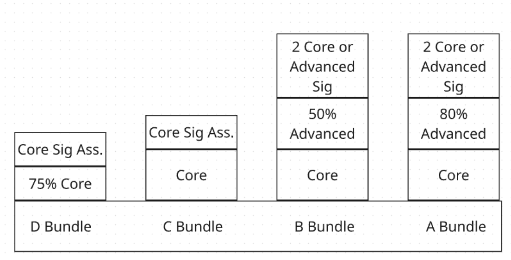

```{r setup, include=FALSE}
knitr::opts_chunk$set(echo = TRUE)
```


```{r eval=FALSE, include=FALSE}
title: "Intro to R  Programming Spring 2026 - Syllabus"
author: "by Lorraine Gaudio"
date:   "`r paste('Lesson generated on', format(Sys.Date(), '%B %d, %Y'))`"
team: "Spring 2026"
output: 
  html_document: # To create an HTML document from R Markdown
    toc: false # Table of contents (TOC)
    toc_depth: 1 #(meaning that level 1, 2, and 3 headers will be included in the table of contents
    toc_float: # Float the table of contents to the left of the main document
      collapsed: false # Collapsed (defaults to TRUE) controls whether the TOC appears with only the top-level
      smooth_scroll: true # controls whether page scrolls are animated when TOC items are navigated to via mouse clicks.
    number_sections: true # Numbering starts with "#" (H1). Without H1 headers, the H2 headers ("##") will be numbered with 0.1, 0.2, and so on.
    css: ../assets/styles.css # This is the name of the CSS file to style the HTML document with Boise State Brand. The CSS file must be in the same directory as the R Markdown file.
    fig_caption: true #Whether figures are rendered with captions.
    df_print: paged # Printing data frames with interactivne scrolling
    code_folding: show # Enables you to include R code but have it hidden by default. (Show hide button)
    includes:
      in_header: ../assets/header.html
      after_body: ../assets/footer.html
      
title: "Intro to R  Programming Spring 2026 - Syllabus"
subtitle: "Boise State University, Anthropology Department"
author: "Professor Lorraine Gaudio"
date:   "`r paste('Report generated on', format(Sys.Date(), '%B %d, %Y'))`"
output: 
  pdf_document:
    toc: true
    toc_depth: 3
    number_sections: true
    citation_package: natbib
    fig_caption: true
    df_print: kable # Data frame printing
    includes:
      in_header: ../assets/header.tex
    latex_engine: xelatex  # Use xelatex to support fontspec
fontsize: 12pt
geometry: margin=1in
mainfont: "Garamond" # Sets the font of the entire document
sansfont: "Gotham-Book.otf" # Set sans-serif font to Gotham Book
monofont: "Courier New" # Set monospace font to Courier New
documentclass: scrreprt
linkcolor: boisestateblue # Customizes the color of hyperlinks
urlcolor: magenta # Customizes the color of URLs
citecolor: black # Customizes the color of citations
bibliography: references.bib # Bibliography file
biblio-style: apalike                 # ⟵ natbib needs a .bst style
natbiboptions: "round,authoryear"     # round brackets, Author (Year)
```

# Welcome to Intro to R Programming!

In this course, you will learn to use the R software environment for data analysis. R is widely used in research and data science for statistical computing and graphics, and we will use RStudio Desktop (not the cloud version) to write, run, and troubleshoot code as part of a reproducible workflow.

## Instructor Information

```{r instructor_photo, echo=FALSE, fig.align='center', out.width="25%"}

```
Email:	**lorrainegaudio@boisestate.edu** (You can call me “Professor Gaudio” or “Lorraine” is fine too!)

Virtual Office Hours:	By appointment; please email to arrange a time.

Office Location: I do not have an office this semester

Contact instructions:	For the quickest response, I prefer that you contact me by email. I usually respond to emails within 24 hours, except on weekends and holidays (I may respond on weekends and holidays, but there is no guarantee). 

# Course Informaiton

We are using a computer lab classroom in **Riverfront Hall (RFH)**, **Room 208**. You must attend the Monday section you are enrolled in (**9:30–10:20 AM** or **10:30–11:20 AM**). You may not attend a different section in place of your own. In-class activities can only be completed in person, so attendance matters. 

**Class Meetings (In-Person)**

- Section 002: Monday, 9:30–10:20 AM

- Section 001: Monday, 10:30–11:20 AM

- Location: Riverfront Hall (RFH), Room 208

## Course Learning Objectives

By the end of the course, you will be able to:

1. Share a reproducible R code workflow using the desktop RStudio.

2. Confidently problem-solve R coding tasks.

3. Demonstrate learning skills & AI competencies in workflow.

## Prerequisites 

**None** other than a basic understanding of how to operate and navigate a computer (especially the file system), the ability to download and upload files with Canvas, and a sense of integrity (especially the academic kind).

## Course Materials

All required materials will be supplied and available to download via Canvas. The following FREE resources are recommended but *not required*. They will help you learn R programming and data analysis concepts more effectively:

- **Introduction to Data Science** by Rafael Irizarry [https://rafalab.dfci.harvard.edu/dsbook-part-1/](https://rafalab.dfci.harvard.edu/dsbook-part-1/). This book provides a comprehensive introduction to data science concepts and R programming.

- **R for Data Science** by Hadley Wickham, Mine Çetinkaya-Rundel, and Garrett Grolemund [https://r4ds.hadley.nz/](https://r4ds.hadley.nz/). This book provides a gentle introduction to programming concepts and R.

- **bookdown: Authoring Books and Technical Documents with R Markdown** by Yihui Xie [https://bookdown.org/yihui/bookdown/]https://bookdown.org/yihui/bookdown/). This book provides a comprehensive guide to using R Markdown for technical writing and documentation.

## Study Time Required

Your weekly time outside of class depends on the grade bundle you are aiming for. These estimates assume you attend Monday lab and work steadily during the week.

- **C grade**: plan for ~2 hours/week outside class (Core readings/quizzes + Core practice to Complete).

- **B grade**: plan for ~3 hours/week outside class (Core work + a meaningful portion of Advanced activities).

- **A grade**: plan for ~3.5 hours/week outside class (Core work + a larger portion of Advanced activities and stronger refinement).

If you fall behind, please do not submit *Not Ready* work. Instead, complete a token request to get a due date extension. Your weekly time may increase near major deadlines.

## Course Format

This is a flipped course: you will complete readings/videos and quizzes in Canvas, then use class time for structured coding practice and applied lab activities. Attendance by enrolled section is required. Attend the section you are officially enrolled in to complete in-class activities. 

### Modules and pacing

The course is organized into modules in Canvas. Module lengths vary. There are 8 modules, plus a signature assignment due near the end of the term. The module schedule and due dates are posted in Canvas.

### Canvas Workflow and Deadlines

**Weekly deadlines** (Mountain Time)

You should expect three recurring deadlines:

- **Thursday 11:59 PM**: core readings + core content quizzes (most modules)

- **Sunday 11:59 PM**: advanced activities + practice assignments (most modules)

- **Monday (end of class)**: in-class activity only; attendance required for submission

Canvas will display the exact due date/time for every item. 

## Grading Information

This course uses Specifications (Specs) Grading, which means your work is evaluated as **Complete** or **Not Ready**. There are no points or partial credit. Each quiz/activity/assignment comes with clear specifications (what “Complete” requires). 

- If your submission meets **every** requirement, it is *Complete*. 

- If it misses **any** requirement, it is *Not Ready* and must be revised and resubmitted. 
This system is designed to be clear, rigorous, and fair: you always know what target you’re aiming for.

Your final course grade is determined by the bundle you complete (A, B, C, or D). In Canvas, every item is labeled Core or Advanced in the assignment title. Core work is the baseline required to pass the course at the C level; Advanced work is optional work that raises your final grade to a B or A. You are responsible for self-monitoring your progress toward the grade you want. 

**Submission standards**: to be marked "*Complete*", submitted the correct files that (1) contain correct code, (2) run top-to-bottom with a clean environment, and (3) include any required memos.

### Final Letter Grades

Final Letter Grades will be based on the following scale:

- **A**: Complete the A Bundle

- **B**: Complete the B Bundle

- **C**: Complete the C Bundle

- **D**: Complete the D Bundle

- **F**: Does not complete the D Bundle

### Bundle requirements



**D Bundle**:

- Complete one Core Signature Assignment, and

- Complete at least 75% of Core items.

**C Bundle**:

- Complete all Core items, and

- Complete one C-level Core Signature Assignment.

**B Bundle**:

- Complete all Core items, and

- Complete 50% of Advanced items, and

- Complete the Signature requirement for B-level or higher: either the Advanced Signature Assignment or both Core Signature Assignments.

**A Bundle**:

- Complete all Core items, and

- Complete 80% of Advanced items, and

- Complete the Signature requirement for B-level or higher: either the Advanced Signature Assignment or both Core Signature Assignments.

**Attention ANTH580**: Anthropology graduate students have an additional signature requirement. Details are provided in Canvas.

This “bundle” structure is intentional: higher course grades require completing more work and/or more challenging work, and you can choose how far you want to go.

### Tokens

**For Late Work & Not Ready Submissions**

You begin the semester with **5 tokens**. Tokens are your built-in safety net: they exist because life happens, and Specs Grading is still meant to be a safe but challenging system. 

**A token can be used to**:

1. Extend a due date by one week, or

2. Revision of late “*Not Ready*” work.

3. Tokens may be used on Signature Assignments.

#### The one week rule (strict)

Tokens only apply within one week after the original deadline. After that 7-day window, late work is **not accepted**.

- If you revise and resubmit **before** the deadline, **no token is required**. Submit assignments early!

- If you revise and resubmit after the deadline, **a token is required**.

#### Quizzes (retakes + deadlines)

- Quizzes can be retaken unlimited times until the quiz due date.

- Only a **100%** score is *Complete*.

- After the due date, anything below 100% is *Not Ready*, unless you use a token to extend the due date.

#### Request token use

To use a token, submit the **Token Request** form in Canvas. In the request, enter the exact Canvas title of the item. You may also include a brief reason only if you believe the situation should be excused; otherwise, the request is treated as standard token use.

If your request follows the course rules (especially the 7-day window after the original deadline), I will reopen/extend the specific item in Canvas for 7 days after the original due date. By default, I will deduct 1 token by updating your **Token Bank** (Tracking Only). Your Token Bank shows how many tokens you have left (starts at 5) and is the official record of your remaining tokens.

# Student Responsibilities

## Communication

Contact the instructor, Professor Gaudio, by email at **lorrainegaudio@boisestate.edu** to ask questions, give status reports, or request 1:1 assistance, if needed. You are encouraged to ask questions directly and immediately. I’d be happy to schedule an in-person or online Zoom session to help you out with any problem, big or small. **Every student in this course can and should be successful.** If you need help, please reach out.

If you notice any problems in the course or seek clarification on an assignment, send me an email or a Canvas Message. If you need technical assistance, please call the Help Desk. For assistance with technical problems in Canvas, please contact the Boise State Help Desk, **helpdesk@boisestate.edu**, tel. 208-426-4357, or see [https://www.boisestate.edu/oit-learning/canvas/](https://www.boisestate.edu/oit-learning/canvas/) and scroll to the Canvas for Students section.

## Student Well-Being

If you are struggling for any reason (COVID, relationship, family, or life’s stresses) and believe these may impact your performance in the course, we encourage you to contact the Dean of Students at (208) 426-1527 or email **deanofstudents@boisestate.edu** for support. Additionally, if you are comfortable doing so, please reach out to me and I will provide any resources or accommodations that I can. If you notice a significant change in your mood, sleep, feelings of hopelessness or a lack of self-worth, consider connecting immediately with Counseling Services (1529 Belmont Street, Norco Building) at (208) 426-1459 or email **healthservices@boisestate.edu***.

## Academic Integrity

**Academic Integrity**: a set of positive values and an agreement with ethical and professional principles, standards, and practices that involve the whole institution.
Honesty, trust, fairness, respect, responsibility, and courage (to name a few)

Boise State promotes Academic Excellence as a core Shared Value, upholding the virtue of honesty in the pursuit of knowledge. Behaving with integrity and honesty is a hallmark of a Boise State University graduate. The conferring of a degree represents the University’s indication that the recipient has engaged in academic work that is representative of her/his own efforts and completed with integrity and honesty.

Upholding academic integrity in all assignments allows students to engage with the material being investigated and assert their evidence-based findings. This behavior demonstrates the commitment to learning and preparation necessary for a successful future. All work you submit must represent your own ideas and effort or be cited, including any material you wrote for another course; when work does not, it is academic dishonesty. Academic dishonesty in any form may result in failure in the course or dismissal from the Program and/or the University. See Boise State’s [Academic Integrity](https://www.boisestate.edu/registrar/general-information-and-policies/academic-integrity/) page for specific behaviors to avoid. 

## Student AI Use

Assignments will explicitly say if and which generative AI (GAI) are allowed and how you are allowed to use them. In this course, you are allowed to use [boisestate.ai](https://boisestate.ai) to help you troubleshoot error messages or support your curiosities. You must not use any AI tool to directly answer your assignment questions for you. Doing so will be a disservice to yourself, as you will not be prepared for subsequent courses. Additionally, this will breach our agreement as outlined in this syllabus and constitute a violation of academic integrity. All code should by physically typed in by you and not copied and pasted from an AI tool or other source.

An essential part of learning and discovery is embracing its challenges. You’re not likely to learn effectively if a task isn’t pushing you out of your comfort zone. GAI tools can make work easier, which is great! However, grit (tenacity) will help you learn. Additionally, there is a risk of over-reliance, preventing you from remaining in control of your work. It is important to avoid skipping steps in the learning and creative process because each step contributes to a deeper understanding of the subject matter. AI should enhance your work, aid your curiosity, and not replace your unique contributions. To ensure generative AI does not blunt or prevent types of insights that you might only achieve through independent effort, you will define an AI-human effort use for your learning and research along with a reflection of how you feel this use case affected your learning. This model would clarify which research stages and processes can lean on AI automation, which need interactive AI tool use, and when the researcher must engage in deeper thought and reflection. 

You will be transparent about when and how generative AI in your memos. Include: 

1. A record of prompt and chat activity. 

2. A reflection on how GAI might have aided or hindered learning or knowledge creation. 

# Instructor Responsibilities

## Instructor AI Use

1. I may use GAI to aid in providing custom and personal feedback on your assignments. Your work is never uploaded into any AI tool. You may choose to opt out when submitting your assignment. 

- Question: Will the AI tool replace instructor grading?

Answer: No. I will never upload your work into an AI tool. Instead, I will use AI to improve on explaining.

- Question: Does opting out affect my grade?

Answer: No. Both submission routes are graded with the same rubric.

2. I use GAI to aid in editing lessons and assignments. I am redesigning this course, and I am using AI to assist me in making improvements.

# Additonal Syllabus Policies

Please refer to these documents for more information about [University Guidelines and Policies](https://docs.google.com/document/d/14ZMRsHAgo356h0nHtJuStDKGwvg6LY-XOA7PxacwECw/edit?usp=sharing), and [Student Expectations and Guidelines](https://docs.google.com/document/d/1tO-RnUbkFoQTNhFLzo7HXers2p_3OS4NUFdowagugNw/edit?usp=sharing).

## Course Content and Idaho Law

Boise State University is committed to free expression, academic freedom, and academic responsibility, as outlined in existing University policies and guidance. In this course, your instructor is dedicated to fostering open, respectful conversations and promoting the exploration of different perspectives. Our goal is to create an environment where you are empowered to engage with and think critically about the content and topics covered in this course. You are not required to agree with everything you read, hear, or discuss; ultimately, you get to decide what you believe. However, we hope you will remain open to listening, reflecting, learning, and asking insightful questions along the way.


Under Idaho law (Section § 67-5909D), some university courses with content related to diversity, equity, inclusion, or critical theory may be subject to certain restrictions. However, the law affirms and does not limit free discussion in the learning environment. Like all Boise State courses, this course supports open inquiry, intellectual honesty, and respectful engagement with a range of perspectives, all of which are consistent with student rights and responsibilities described in the [Student Code of Conduct (Policy 2020)](https://www.boisestate.edu/policy/student-affairs/code-of-conduct/).

It is your responsibility to review the course syllabus closely to understand the course content and expectations.

This course provides a space for open dialogue and thoughtful discussion, including around complex or challenging topics. Everyone is expected to engage with curiosity, listen respectfully, and contribute in ways that support a productive and welcoming learning environment.

Boise State and the Idaho State Board of Education affirm the importance of free expression and academic inquiry. As outlined in SBOE Policy III.B:


**"Membership in the academic community imposes on administrators, faculty members, other institutional employees, and students an obligation to respect the dignity of others, to acknowledge the right of others to express differing opinions, and to foster and defend intellectual honesty, freedom of inquiry and instruction, and free expression on and off the campus of an institution."**

Disruptive behavior that interferes with the learning environment will not be tolerated and may result in removal from this course, in line with university policy [(See Policy 3240 Maintaining Effective Learning Environments)](https://www.boisestate.edu/policy/academic-affairs-student/maintaining-effective-learning-environments/).

Your instructor will foster critical discussion and analysis, and a respectful consideration of a wide range of ideas, in accordance with the [Faculty Code of Rights, Responsibilities, and Conduct (Policy 4000)](https://www.boisestate.edu/policy/academic-affairs-faculty-administration/faculty-code-of-rights-responsibilities-and-conduct/). You are encouraged to question ideas and form your own conclusions.

As always, you have the freedom to choose courses that align with your academic goals—if you have concerns about course content, please talk with your instructor. Your academic advisor is a great resource to explore additional course options. Refer to the [academic calendar](https://www.boisestate.edu/registrar/boise-state-academic-calendars/) for important deadlines related to adding and dropping classes.

To learn more about this law and how it applies to courses at Boise State, visit this [link](https://www.boisestate.edu/academics/information-regarding-section-67-5909d-course-and-curriculum/).


