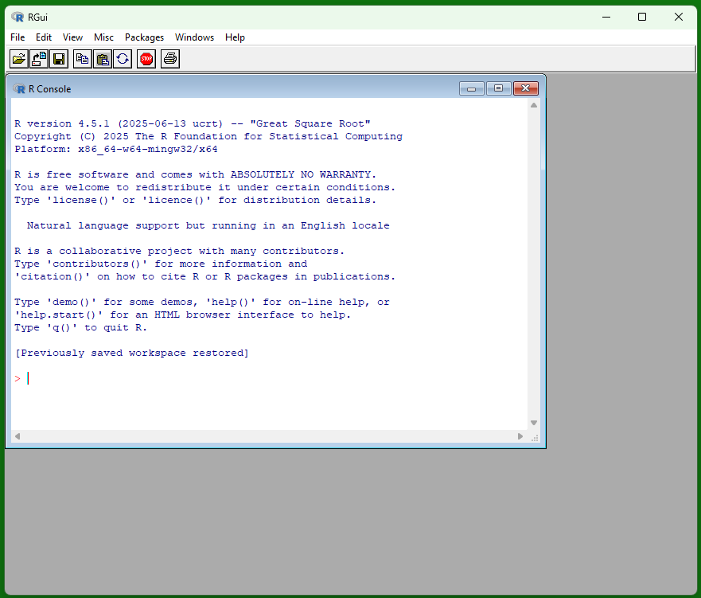
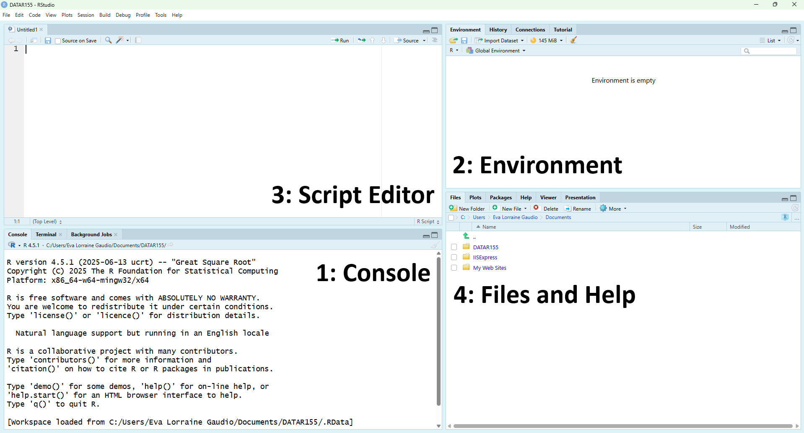

```{r setup, include=FALSE}
knitr::opts_chunk$set(echo = TRUE)
```

Welcome to _Introduction to R Programming_! This course is for students who expect to work with data—in their majors, in research, industry, or graduate study. You will be in class with first-year undergraduates and advanced graduate students, with backgrounds ranging from biology and psychology to anthropology, engineering, business, and the humanities. Some of your classmates already code in languages like Python; others are opening RStudio for the first time. The course is designed so that no programming experience is assumed, while still offering meaningful extension work for those who want more depth or need R for thesis and research projects.

Over seven weeks, you will learn to use R with the desktop version of RStudio to create transparent, reproducible analyses that another person can re-run on a different computer. Early modules focus on the foundations: navigating RStudio, managing your workspace, writing and submitting clean R scripts, and keeping a record of the objects you create. From there you will build up a working toolkit with vectors, functions, and missing-data handling; move into importing data from real files; and practice wrangling datasets with base R indexing, logical tests, and the `dplyr` verbs that power much of modern data science. In the final stretch, you will create visualizations with `ggplot2`, run basic simulations, and assemble an end-to-end mini-analysis that demonstrates readiness for your next statistics or data course.

The course is not only about code. Each module asks you to document your thinking as you work: stating goals, making predictions, and writing short memos about what you tried, what failed, and what finally worked. You will practice asking questions, persisting through bugs, revisiting your reasoning and examine how and when to use AI tools as part of your workflow. Throughout, you will be expected to type your own code, to disclose when you consult outside resources (including AI), and to treat reproducibility and integrity as central parts of doing data work, not as afterthoughts.

# Required Software

Lessons are hands-on. To follow along, you must have both **R** and **RStudio** installed on your own computer. These are two separate pieces of software that work together. They run on Windows, macOS, and Linux.

- **R** is a programming language and engine that runs your R code.

- **RStudio Desktop** is an integrated development environment (IDE) that makes writing, running and organizing R code easier. In this course, you will always use RStudio to interact with R. You must use the **desktop** version locally (not the Posit Cloud or other browser-based tools).

RStudio does not include R. You must install R first, then RStudio Desktop, which will detect your R installation when it starts. 

## Download and Install R

1. Go to the [CRAN R Project for Statistical Computing](https://cran.r-project.org/) website.

2. Download the correct file for your operating system. 

a. **Windows**: Click on the "Download R for Windows" link if you are using Windows. You will download an `.exe` file. Open the file and accept defaults. Do not change the file location to your OneDrive cloud folder. 

b. **macOS**: Click "Download R for macOS" if you are using a Mac. You will download a `.pkg` file. Open the file and accept defaults. You’ll get both the R framework and the R.app GUI.

c. **Linux**: Click the [Linux folder of the Cran website](https://cran.r-project.org/bin/linux/) link and follow your distribution’s installation instructions.



If you double-click the R icon after installation, you may see a window like this, called the R console (or RGui on Windows). This is the base interface that comes with R, and it can run R code, but we will not use it in this course. Instead, you will always write, run, and save your work in **RStudio Desktop**, which provides a script editor, projects, and tools that make your analyses easier to organize, share, and reproduce.

## Download and Install RStudio

1. Go to the [RStudio download page](https://posit.co/download/rstudio-desktop/).

2. Choose the installer for your operating system and run it, accepting defaults.

a. **Windows**: Select the Windows installer (a file ending in `.exe`). After it downloads, double-click the file and follow the prompts, accepting the default options.

b. **macOS**: Select the macOS installer (a file ending in `.dmg`). After it downloads, double-click the file, then drag the RStudio icon into your Applications folder if prompted, or follow the installer’s instructions.

c. **Linux**: Select the installer that matches your Linux distribution (for example, a `.deb` package for Ubuntu/Debian or an `.rpm` package for Fedora/RHEL/OpenSUSE). Download the file and install it using your system’s standard package tools (e.g., `dpkg`, `apt`, or `dnf`).

3. After installation, open **RStudio Desktop**. It should automatically detect the version of R you already installed. If RStudio does not start or cannot find R, reinstall R and then reopen RStudio.

## Intallation Video Tutorials

If you prefer a video walkthrough, you can watch a short tutorial:

**Windows**:
[How to install R and RStudio - a practical guide](https://www.youtube.com/watch?v=aiBWLfHeWGE)

**macOS**:
[How to Correctly install R and RStudio on MacOS (2025)](https://www.youtube.com/watch?v=8NvvydRwxEI)

**Linux**:
[How To Install R and RStudio on Ubuntu 24.04 LTS](https://www.youtube.com/watch?v=7RSq4uuS36A)

# RStudio Interface

Open **RStudio Desktop** and follow along by typing in the code examples below. 


You should see a window with four main panes (sections).

1. **Console** – where R runs commands and shows results  
2. **Environment** – where you can see the objects (data, vectors, functions) in your current session  
3. **Script Editor (Source)** – where you write and save your R scripts and notebooks 
4. **Files and Help** – where you browse files and access plots, packages, and help pages



*Tip.* If your layout looks different, that’s okay—RStudio lets you move panes. Look at the **tab labels** in each pane (for example, *Console*, *Environment*, *Files*, *Help*) to identify them. You can always reset the layout later using **Tools → Global Options → Pane Layout**.
 

## Console

The Console is where R runs commands. 

🎯 Try a few calculations.

```{r eval=FALSE}
# ⚡ Type this in the Console and press Enter
2 + 2
3 * (5 + 1)
10 / 4
sqrt(81)
```


🗣 R prints results immediately. 

💡 If you make a typo, use the **Up/Down arrow keys** to go back through previous commands, edit the line, and press Enter to re-run it.

## Global Environment

During a session, R creates **objects** (such as numbers, vectors, data tables, or models) only when you tell it to store a result. The **Environment** pane lists all of the objects that currently exist in your R session and gives a quick preview of their contents.

### Naming and Storing Results

The assignment operator `<-` is used to **store** a result in an object (a named container). This is how you give a result a name so you can reuse it later.

🎯 Use `<-` to store the result of `2 + 2` in an object named `value`.

```{r}
# ⚡ Type this in the Console and press Enter
value <- 2 + 2
```


🗣 A new object called `value` appears in the Environment pane, with its stored value. Notice that nothing printed in the Console when you ran the assignment; the result was saved instead of displayed. The Environment pane helps you track which names currently exist.

🎯 Print the stored value by typing the name of the object in the console and pressing Enter.

```{r eval=FALSE}
# ✅ 
value
```


### Using Objects in Calculations

Objects behave like reusable building blocks: once you have stored a value in an object, you can use that object inside new calculations.

🎯 Create a new object named `total` that uses the existing `value` object in a calculation.

```{r}
# ⚡  Type this in the Console and press Enter
total <- 3 * (5 + value)
```


🗣 The new object named `total` appears in the Environment pane containing the single value "27". You can now use total in later commands the same way—by typing its name in the Console or inside other expressions.

### Saving Objects

By default, RStudio does not save your workspace (the objects in your Environment) when you close it. To save objects in your Environment for future sessions, you can use the `save()` function or click the floppy disk icon in the environment pane.

Before you save, you will need to know where your working directory is. You can check this with:

```{r eval=FALSE}
getwd()  # current working directory
```


🎯 Save your entire workspace to a file named `workspace.RData` in your working directory.

```{r}

# Save the entire workspace
save.image(file = "workspace.RData")
```


### Removing Objects


You can view or remove items:

```{r}
# Look at what's in the environment
ls()

# Remove one object 
rm(total)
```

## Script Editor (Source)

To document and track your work, use the Script Editor (Source pane). Here, you can write and save R code in a script file.


To create a new script, click the "New File" icon (or use Ctrl+Shift+N). Manually type in the following script.

```{r}
# install_r_script.R
# Lines that start with # are comments for humans, not code for R to run.

# 1) Do some math
a <- 6 * 7
b <- a + 5
result <- b / 3

# 2) Check the results
a
b
result

# 3) A tiny vector example
scores <- c(88, 92, 76, 95)
mean(scores)   # average
length(scores) # how many values?
```

Running code from a script (order matters!)

1. Place your cursor on a line and click Run (or press Ctrl+Enter on Windows/Linux or Cmd+Return on macOS) to send that line to the Console where it executes.

2. Select multiple lines to run them together.

3. Run in order from top to bottom so that objects (like a, b, scores) exist before you use them.

Pro move: You can quickly comment/uncomment selected lines with Ctrl+Shift+C (Windows/Linux) or Cmd+Shift+C (macOS).

## Files

Now save your script it with Ctrl+S. Navigate your folder system to find a good place to save it, like your Documents folder for this course. Name it `firstlastname_install_r_script.R`.

The Files pane shows files in your current working directory. You can navigate folders, open files, and manage your workspace here. 

```{r eval = FALSE}
getwd()        # current working directory (matches what Files is showing)
```

```{r}
# setwd("C:/Users/YourName/Documents/") # change to your desired folder
```

Note: Students using OneDrive may find issues navigating the folder system. 

## RStudio Projects

RStudio Projects help you organize your work. They create a self-contained environment with its own working directory, making it easier to manage files and settings. It's best practice to use a separate project per course or project. A project keeps all files—scripts, data, outputs—in one self-contained folder, making things organized, reproducible, and shareable. Using an RStudio project eliminates the need for setwd(). Instead, file paths can be relative to the project folder, which makes scripts more portable.

1. Go to File → New Project…

2. In the dialog that appears, choose “New Directory”.

3. Select “Empty Project” (simplest for begginers) 

4. Give your project a meaningful name like "Intro_to_R" and choose where it’ll be on your computer.

5. Click Create Project.

- This makes a new folder at the chosen location.

- Inside this folder, RStudio creates a .Rproj file 

6. RStudio automatically sets your working directory to this new project folder. Everything you read or write in R will happen here. Confirm with:

```{r, eval=FALSE}
getwd()  # should show your new project folder
```

Close the project by going to File → Close Project.

Practice opening the project again by 

1. Closing RStudio. Now find your project folder in your file system and double-click the .Rproj file and this will open RStudio.

2. Going to File → Open Project and selecting the .Rproj file you just created.


